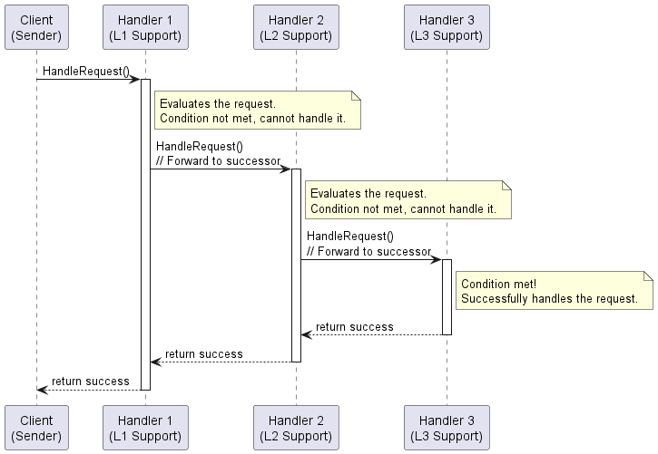
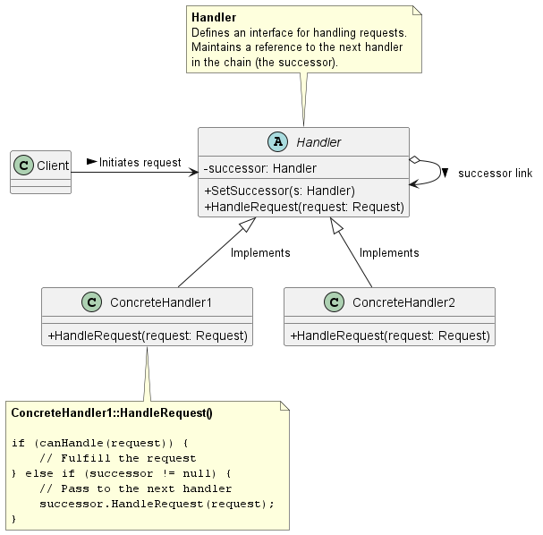
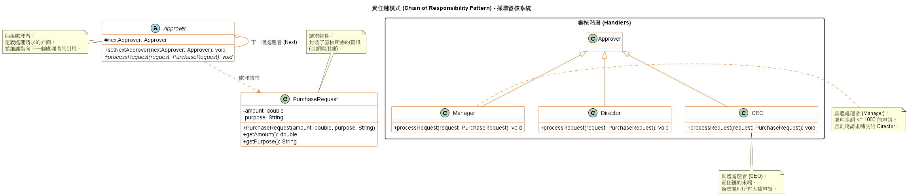

# 責任鏈模式 (Chain of Responsibility Pattern)

在維護大型分散式系統、設計微服務架構，或是處理系統告警（Alerts）與中介軟體（Middleware）時，我們經常需要一個機制來優雅地處理各式各樣的請求。

如果我們將所有處理請求的邏輯（如 `if-else` 或 `switch` 判斷式）全部寫死在同一個類別中，系統將會變得極度臃腫且難以維護。為了解決這個問題，**責任鏈模式 (Chain of Responsibility Pattern)** 提供了非常靈活的底層架構。

1. 責任鏈模式的核心概念

    **定義：** 避免將請求的發送者與接收者耦合在一起，讓多個物件都有機會處理該請求。將這些接收物件串連成一條鏈，並沿著這條鏈傳遞請求，直到有物件處理它為止。

    這就像是 IT 團隊中的「告警升級機制 (Alert Escalation)」。當系統發生異常時，告警（請求）首先發送給 L1 客服（第一個處理者）。如果 L1 能夠解決，就直接處理掉；如果問題太複雜，L1 就會把問題轉交（Forward）給 L2 工程師。如果 L2 也無法解決，再往上轉交給 L3 資深架構師。在這個過程中，發送告警的系統完全不需要知道最後到底是誰解決了問題，它只需要把請求丟給這條「責任鏈」的開頭即可。

2. 背後支撐的核心設計原則

    責任鏈模式之所以被廣泛應用在 Web 伺服器的 Filter、API Gateway 的攔截器中，是因為它實踐了以下設計原則：

    1. **鬆耦合 (Loose Coupling / Decouple Senders and Receivers)：** 
       發送者 (Sender) 不需知道具體是哪一個接收者 (Receiver) 處理了請求。這大幅簡化了物件之間的互相關聯，發送者只需保留對這條鏈的參考即可。
    2. **開放封閉原則 (Open-Closed Principle)：**
       賦予系統在分配職責時極大的彈性。你可以隨時在執行期間 (Runtime) 動態地加入新的處理節點、移除節點，或是改變節點的順序，而完全不需要修改現有的程式碼。
    3. **單一職責原則 (Single Responsibility Principle)：**
       每一個處理者 (ConcreteHandler) 只需要專注於判斷「這是不是我該處理的請求？」以及「如果是，我該怎麼處理？」。這消滅了傳統架構中巨大的 `if-else` 上帝類別。

    責任鏈模式有一個需要注意的副作用：「不保證請求一定會被處理 (Receipt isn't guaranteed)」。如果請求走到責任鏈的末端，卻沒有任何一個節點願意處理它，這個請求就會悄悄地被丟棄。因此在實務上，我們通常會在鏈的尾端設置一個「預設處理者 (Catch-all Handler)」來捕捉這些未處理的異常。

3. 責任鏈模式：流程圖與類別圖 (PlantUML)

    為了讓初學者清楚理解流程，我為你繪製了兩個圖表：一個表示動態執行流程的**循序圖 (Sequence Diagram)**，另一個表示靜態架構的**類別圖 (Class Diagram)**。

    動態執行流程圖 (Sequence Diagram)

    

    系統架構類別圖 (Class Diagram)

    這張圖展示了物件之間的繼承與合成關係，展現了如何透過 `successor` (繼任者) 變數來建立這條鏈。

    

4. 總結

    責任鏈模式優雅地將請求的「發送端」與「接收端」解耦。作為系統工程師，我們在實作防火牆過濾規則 (Firewall Rules)、API 權限驗證 (Authentication Filters) 或是系統日誌分級寫入 (Log Routing) 時，這個模式是讓系統保持乾淨、可擴充的最佳選擇。

5. 範例程式碼類別圖

    

    1. 解耦 (Decoupling)：客戶端（測試代碼）只需要將請求發送給鏈中的第一個節點如 `Manager`，不需要知道具體是誰最終處理了該請求。

    2. 自關聯 (Self-Association)：在 `Approver` 類別中，`nextApprover` 的引用是此模式的核心。它形成了一條邏輯上的鏈。

    3. 單一職責原則：每個審核者（Manager, Director, CEO）只關心自己權限範圍內的業務邏輯。如果超出權限，則明確*轉發*給下一棒。

    4. 動態配置：這條鏈是在運行時（Runtime）透過 `setNextApprover()` 建立的。這表示可以輕鬆地調整審核順序，或在中間插入新的審核角色如副總裁，而不需要修改現有的類別代碼。
