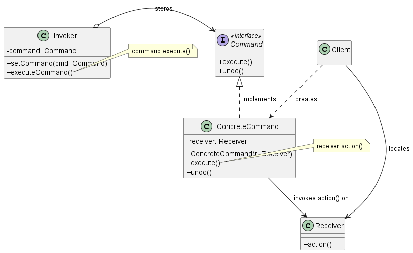
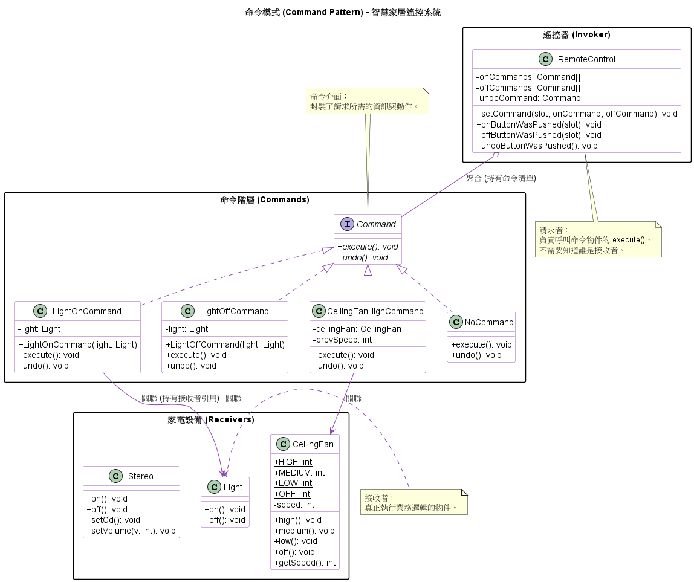

# 命令模式 (Command Pattern)

在建構高併發系統、非同步任務處理（Task Queues）或是分散式交易系統時，我們經常需要將「發出請求的系統元件」與「實際執行請求的底層服務」徹底解耦。

為了解決這類問題，**命令模式 (Command Pattern)** 便是我們最常使用的經典底層架構。它能將動作抽象化，讓系統變得極度靈活。

1. 什麼是命令模式

    **核心定義：** 將一個請求（Request）封裝成一個物件，從而讓你能夠使用不同的請求對客戶端進行參數化、將請求放入佇列或記錄日誌，並且支援可復原（Undoable）的操作。

    **生活化的比喻（餐廳點餐）：**
      想像你身處在一家餐廳，這就是命令模式最完美的縮影：
      1. **客戶 (Client)：** 決定點什麼菜，並建立一張「訂單 (Command)」。
      2. **服務生 (Invoker)：** 接過訂單，將它夾在出菜口，大喊「上菜！」。她不需要知道這道菜怎麼做，只需要知道這張訂單可以被「執行」。
      3. **廚師 (Receiver)：** 收到訂單後，依照訂單內容準備餐點。廚師負責真正執行的邏輯。

    透過訂單 (Command)，服務生與廚師被完美解耦了！

2. 命令模式背後的核心設計原則

    命令模式之所以在系統工程中如此強大，是因為它深度契合了以下幾個物件導向與系統設計原則：

    1. **封裝方法呼叫 (Encapsulate Method Invocation)：**
        一般來說，我們是找出系統中*會變動的部分*並將其封裝。在命令模式中，我們封裝的是*請求（動作）*本身。它將請求轉化為第一級物件 (First-class objects)，讓你可以像傳遞普通變數一樣，傳遞、儲存或丟棄這些運算邏輯。

    2. **發出者與接收者解耦 (Decouple Sender and Receiver)：**
        體現了*致力於讓互動的物件之間保持鬆耦合*的原則。呼叫者 (Invoker) 只需要知道呼叫 Command 的 `execute()` 方法，完全不需要知道底層實作細節，也不用認識真正負責處理的接收者 (Receiver) 是誰。

    3. **對擴展開放，對修改封閉 (Open-Closed Principle, OCP)：**
        當系統需要增加新的命令（例如新增一個 API 或任務類型）時，我們只需要新增一個實作了 `Command` 介面的類別即可。完全不需要修改現有的呼叫者 (Invoker) 或基礎架構程式碼。

3. 命令模式類別圖 (Class Diagram)

      

      **角色拆解：**
      * **Command (命令介面)：** 所有命令的共通介面，通常包含一個 `execute()` 方法，有時也會支援復原機制的 `undo()`。
      * **ConcreteCommand (具體命令)：** 封裝了特定的 `Receiver` 與一組動作。當 `execute()` 被呼叫時，它會去觸發 Receiver 身上對應的方法。
      * **Invoker (呼叫者)：** 持有 Command 物件，負責在適當的時機要求 Command 執行請求。
      * **Receiver (接收者)：** 真正知道如何執行該請求並完成工作底層元件。

4. 實務應用場景

    在大型系統架構中，命令模式是解決併發與容錯問題的利器：

    * **工作佇列與執行緒池 (Job Queues & Thread Pools)：**
        我們將每一個耗時的非同步運算（例如影像處理、網路下載）封裝成 Command 物件並塞入 Queue 中。另一端的 Worker Threads 不斷從 Queue 取出 Command 並呼叫 `execute()`。Worker Thread 完全不需要知道它正在處理什麼任務，達成了高度的任務排程解耦。
    * **系統交易日誌與災難復原 (Logging & Disaster Recovery)：**
        在分散式系統或資料庫中，為了防止 Crash，我們可以為 Command 加上 `store()` 與 `load()` 方法。在執行前將 Command 序列化並寫入硬碟（類似 Write-Ahead Logging）。若伺服器當機，重啟時只要將日誌中的 Command 重新讀取出來並依序執行 `execute()`，就能完美還原系統狀態。
    * **強大的復原與重做機制 (Undo / Redo)：**
        實作 `undo()` 方法，並將所有執行過的 Command 存入一個堆疊 (History Stack)。當使用者要求復原時，只需從 Stack 彈出最後一個 Command 並呼叫 `undo()` 來反轉操作，這在文字編輯器或大型設定變更管理 (Configuration Management) 中極為常見。

5. 其他重點

    * **空物件 (Null Object)**：這是一個實用的技巧。為了避免在 Invoker 中進行大量的 `if (command != null)` 檢查，可以建立一個 `NoCommand` 物件，它的 `execute()` 方法是空的。在初始化時，將所有插槽都填入這個空物件，這樣可以確保每個插槽都有一個有效的命令可以呼叫。
    * **Lambda 運算式**：在現代 Java 中，如果 Command 介面是函數式介面（只有一個抽象方法，如 `execute()`），則可以用 Lambda 運算式來取代簡單的 ConcreteCommand 類別，大幅簡化程式碼。

    總結來說，命令模式是一個非常靈活的行為模式，它將*行為的請求*從*行為的實作*中分離出來，使得請求可以像一般物件一樣被傳遞、儲存和操作，從而實現了高度的解耦和彈性。

6. 範例程式碼類別圖

    
