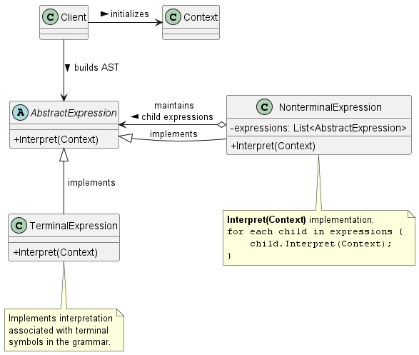
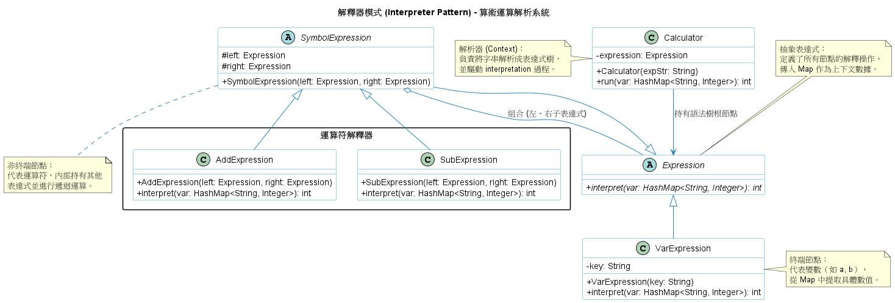

# 解譯器模式 (Interpreter Pattern)

在建構底層基礎設施時，有時候我們會面臨某種*特定且不斷重複出現的問題*，例如：解析特定的系統日誌格式、自訂的告警規則引擎 (Alerting Rules)、或是權限匹配條件。與其為每種條件寫死複雜的演算法，不如我們直接發明一種簡單的*小語言 (Language)*或語法來描述這些規則。

**解譯器模式 (Interpreter Pattern)** 正是為此而生。當給定一個語言時，它會為該語言的文法定義出一種表示方式，並提供一個解譯器來直譯該語言中的句子。

1. 解譯器模式的核心概念

      在解譯器模式中，我們會將文法中的「每一條規則」都對應到一個具體的物件類別。當系統讀取到一段句子或運算式時，會將其轉換成一棵**抽象語法樹 (Abstract Syntax Tree, AST)**。這棵樹由兩種節點組成：
      * **終結符號 (Terminal Expression)：** 語法中最基本的元素（例如常數、變數），它位於樹的葉節點，不再包含其他運算式。
      * **非終結符號 (Nonterminal Expression)：** 包含了其他運算式的複合規則（例如「AND」、「OR」、「迴圈」），它會將直譯的任務遞迴地委派 (Delegate) 給它的子節點。

2. 背後支撐的核心設計原則

      解譯器模式的底層架構，高度依賴並展現了以下設計原則：

      1. 開放封閉原則 (Open-Closed Principle)
         * **模式體現：** 因為文法中的每個規則都被封裝成獨立的類別，所以當你需要改變或擴充文法時（例如新增一種特定的運算規則），系統展現了極高的彈性。你只需要新增一個對應的運算式類別並加入語法樹即可，現有的直譯邏輯完全不需要修改。

      2. 遞迴的組合模式原則 (Recursive Composition)
         * **模式體現：** 抽象語法樹本質上就是**組合模式 (Composite Pattern)** 的具體應用。非終結符號扮演了容器 (Composite) 的角色，而終結符號則是葉節點 (Leaf)。這讓系統在直譯整棵語法樹時，能夠以完全一致的介面遞迴呼叫 `Interpret()` 方法，客戶端完全不必在乎底下到底包含了多複雜的巢狀結構。

      3. 單一職責原則 (Single Responsibility Principle)
         * **模式體現：** 每個類別只負責處理文法中的單一規則。這使得每個類別的實作邏輯都非常明確且易於撰寫，甚至可以透過編譯器產生器自動產生這些類別。

3. 解譯器模式類別圖 (Class Diagram)

      

      **系統角色拆解：**
      * **`AbstractExpression` (抽象運算式)：** 宣告了一個所有語法樹節點都必須共用的 `Interpret` 抽象操作。
      * **`TerminalExpression` (終結運算式)：** 實作與文法中終結符號相關的解譯邏輯。句子中的每一個終結符號都需要一個實例。
      * **`NonterminalExpression` (非終結運算式)：** 為文法中的複合規則（如 $R ::= R_1 R_2 ... R_n$）維護一個指向子運算式 (`AbstractExpression`) 的參考，並實作遞迴直譯的邏輯。
      * **`Context` (全域上下文)：** 包含了解譯器所需要的全域狀態，或是輸入字串目前的匹配進度等資訊。
      * **`Client` (客戶端)：** 負責建立（或接收）表示特定句子的抽象語法樹 (AST)，配置好 `Context`，然後啟動最頂層的 `Interpret` 操作。

4. 總結

      在實務的系統架構中，解譯器模式有幾個致命傷與進階的優化技巧需要注意：

      1. **複雜文法難以維護：** 模式規定了文法中的「每一個規則」都必須有一個對應的類別。如果你的語言非常複雜，這會導致類別數量暴增而難以維護。面對複雜文法，我們通常會改用專門的編譯器或語法分析產生器 (Parser Generator，如 Yacc 或 ANTLR) 來處理。
      2. **效能隱憂 (Efficiency)：** 直接透過遞迴走訪 AST 來解譯字串，通常不是最有效率的作法。在講求極致效能的後端過濾器或路由系統中，我們通常會先將這些語法樹*編譯或轉換*成其他的形式，例如將常規表達式 (Regular Expression) 轉化成狀態機 (State Machine) 再來執行。
      3. **記憶體優化：** 如果語法樹中出現大量的重複終結符號（例如程式碼中不斷出現的特定變數名稱或字串），我們強烈建議引入 **享元模式 (Flyweight Pattern)** 來共用這些終結符號的實例，避免系統因為過多的微小物件而造成記憶體耗盡。
      4. **行為的抽離：** 如果你發現你的語法樹不僅需要 `Interpret()`，未來還需要型別檢查 (`TypeCheck()`)、程式碼產生或格式化輸出 (`PrettyPrint()`) 等一堆操作，若不斷修改節點類別將陷入維護噩夢。這時可以結合 **訪問者模式 (Visitor Pattern)**，將所有解譯與檢查邏輯從樹節點中抽離到獨立的物件裡，會是更靈活的進階架構。

5. 範例程式碼類別圖

      

      1. 遞迴結構：`SymbolExpression` 繼承自 `Expression` 並同時持有了兩個 `Expression` 物件（`left` 與 `right`）。這種組合關係形成了樹狀結構（Abstract Syntax Tree），是解釋器模式的核心。
      2. 分離解析與執行：
         * 解析：`Calculator` 的建構子負責將字串（如 a+b）轉換成物件結構。
         * 執行：`Expression.interpret()` 負責走訪這棵樹並計算結果。
      3. 上下文（Context）：在此實作中，`HashMap<String, Integer>` 扮演了 Context 的角色，儲存了變數名稱與其對應數值的映射關係。
      4. 擴充性：如果想增加一個乘法運算（`MultiExpression`），只需繼承 `SymbolExpression` 並實作其 `interpret` 方法，完全符合開閉原則。
