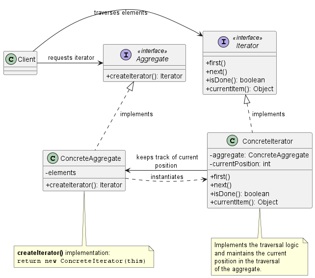
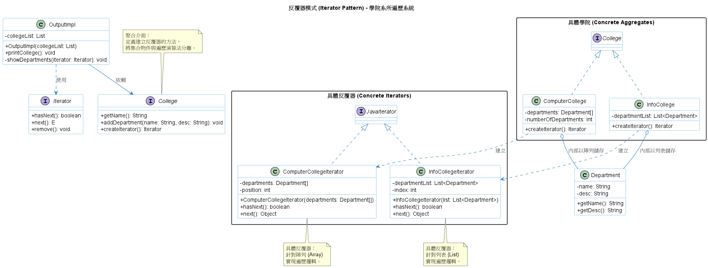

# 迭代器模式 (Iterator Pattern)

在設計大型分散式系統或底層資料處理框架時，我們經常會需要將大量的資料儲存到不同的集合（Collections/Aggregates）中，例如陣列 (Array)、串列 (List)、雜湊表 (Hash Map) 或樹狀結構 (Tree) 等。當系統的不同模組需要走訪（Traverse）這些資料時，如果讓客戶端直接接觸到底層的資料結構，會造成極高的系統耦合度。

為了解決如何在不暴露內部資料結構的前提下，統一且安全地走訪各種集合的問題，**迭代器模式 (Iterator Pattern)** 提供了最經典且優雅的底層架構解法。

1. 迭代器模式的核心概念

    **定義：** 迭代器模式提供了一種方法，讓你能循序存取一個聚合（Aggregate）物件中的各個元素，而又不需要暴露該物件的底層內部表示方式。

    在沒有迭代器模式的情況下，如果一個模組使用陣列 (`Array`) 儲存資料，另一個模組使用 `ArrayList` 儲存資料，當客戶端需要印出所有資料時，就必須針對不同的資料結構撰寫多個不同的迴圈（例如一個用 `length`，一個用 `size()`），這會讓客戶端的程式碼與具體的集合實作綁死。

    迭代器模式透過建立一個獨立的迭代器 (Iterator)物件來封裝走訪的邏輯。客戶端只需要呼叫迭代器的統一介面（例如 `hasNext()` 和 `next()`），就能夠無縫地走訪各種不同的資料集合，而完全不需要知道背後到底是哪一種資料結構。

2. 背後支撐的核心設計原則

    我們之所以高度依賴迭代器模式，是因為它完美體現了以下幾個物件導向的核心設計原則：

    1. 單一職責原則 (Single Responsibility Principle, SRP)
        * **原則定義：** 一個類別應該只有一個改變的理由。
        * **模式體現：** 一個集合物件（Aggregate）的首要責任應該是*管理它所包含的資料*。如果我們同時把*走訪資料的邏輯*也寫在集合物件裡面，那這個類別就會有兩個改變的理由，資料結構改變，或是走訪演算法改變。迭代器模式將走訪的責任從集合中抽離出來，交給獨立的迭代器物件，這不僅簡化了集合的介面與實作，也讓各個類別的職責回到應有的位置。

    2. 針對介面寫程式，而不是針對實作寫程式 (Program to an interface, not an implementation)
        * **模式體現：** 客戶端只依賴抽象的 `Iterator` 介面與 `Aggregate`（集合）介面。這讓系統達成了多型迭代 (Polymorphic Iteration)：我們可以寫出一個接收 `Iterator` 參數的函式，它就能夠走訪任何支援該介面的集合，完全不在乎底層究竟是哪種資料結構。

    3. 封裝變動的部分 (Encapsulate what varies)
        * **模式體現：** 每種資料結構的走訪方式都在不斷變化（例如樹狀結構與串列的走訪方式完全不同）。迭代器模式將這些會變動的走訪演算法封裝進具體的迭代器物件中，向外部隱藏了複雜性。

3. 迭代器模式類別圖 (Class Diagram)

    

    **角色拆解與運作流程：**
    * **`Aggregate` (聚合介面)：** 定義了一個用來產生迭代器物件的介面 `createIterator()`。
    * **`ConcreteAggregate` (具體聚合)：** 實作產生迭代器的介面，並回傳一個與其內部資料結構相對應的具體迭代器實例。
    * **`Iterator` (迭代器介面)：** 定義了存取與走訪元素所需的方法，例如在 Java 中最常見的是 `hasNext()`, `next()`, 與 `remove()`。
    * **`ConcreteIterator` (具體迭代器)：** 實作迭代器介面，並在內部追蹤走訪該集合目前的進度與位置。

4. 總結

    1. **外部迭代器 (External Iterator) vs. 內部迭代器 (Internal Iterator)：**
        我們上面實作的是「外部迭代器」，也就是由客戶端主動呼叫 `next()` 來控制走訪進度，這提供了極大的靈活性。另一種則是「內部迭代器」，客戶端只需傳入一個操作（Operation/Function），迭代器就會自動走訪所有元素並套用該操作；內部迭代器用起來簡單，但靈活性較差。
    2. **併發修改的危險 (Concurrent Modification / Robustness)：**
        在多執行緒的高併發系統中，這是一個極度危險的地雷。如果正在使用迭代器走訪一個集合，同時另一個執行緒對該集合新增或刪除了元素，可能會導致存取到錯誤的元素或直接拋出例外。實務上必須實作「健壯的迭代器 (Robust Iterator)」，確保在走訪過程中插入或移除元素不會干擾走訪進度，或者使用鎖 (Locks) 來確保執行緒安全。
    3. **多重走訪 (Multiple Pending Traversals)：**
        因為每一個迭代器物件都獨立儲存了自己當前的走訪狀態（如 `currentPosition`），所以同一個集合可以同時被多個不同的迭代器走訪，而不會互相干擾。

5. 範例程式碼類別圖

    

    1. 分離集合與遍歷 (Separation of Concerns)：

        * College 類別負責管理系所資料（增加系所、獲取名稱）。
        * Iterator 類別則專注於遍歷邏輯（如何移動指標、檢查是否還有下一個元件）。

    2. 封裝內部的複雜性：

        * ComputerCollege 內部使用 Department 陣列 (Department[])。
        * InfoCollege 內部使用 Department 列表 (`List<Department>`)。
        * 對客戶端 OutputImpl 來說，它不需要關心底層是用陣列還是列表，統一呼叫 `createIterator()` 即可。

    3. 多型 (Polymorphism)：

        客戶端程式碼 `showDepartments(Iterator iterator)` 僅針對介面進行程式設計，因此即使未來增加了一個使用 Map 儲存資料的新學院，也只需要新增對應的反覆器實作，而不必修改顯示邏輯。

    > 此實作巧妙地利用了 Java 內建的 java.util.Iterator，這符合現代 Java 開發中常見的實踐方式。
