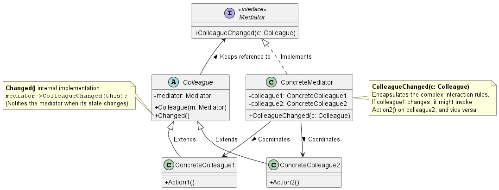
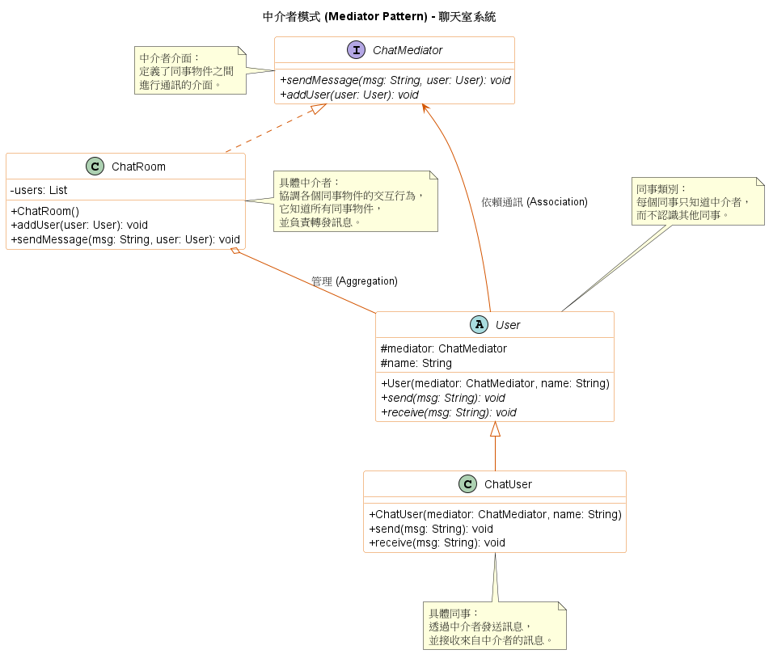

# 中介者模式 (Mediator Pattern)

在建構大型分散式系統、微服務架構，或是設計包含大量互動元件的圖形化使用者介面（GUI）時，我們經常會遇到一個效能與維護上的噩夢：**元件之間出現了複雜的多對多 (Many-to-Many)網狀通訊**。

當系統中的每個物件都需要知道並呼叫其他物件時，系統會變得有如一塊鐵板（Monolithic），任何微小的修改都會牽一髮動全身，這在系統架構中是極度脆弱的設計。為了解決這個通訊複雜度爆表的問題，**中介者模式 (Mediator Pattern)** 提供了非常漂亮且集中的底層架構解法。

1. 中介者模式的核心概念

      **定義：** 定義一個能封裝一組物件如何互動的物件。中介者藉由避免物件之間明確地互相參考，來促進鬆散耦合 (Loose Coupling)，並且讓你能夠獨立地改變它們的互動方式。

      **比喻：**
      想像一個智慧家庭系統，裡面有鬧鐘、咖啡機、行事曆和自動灑水器。如果沒有中介者，當鬧鐘響起時，鬧鐘必須自己去呼叫咖啡機開始煮咖啡，還要檢查行事曆是不是週末，甚至去關閉灑水器。這讓所有的家電物件「緊密耦合 (Tightly Coupled)」在一起。

      導入中介者（例如一個智慧家庭中控中心）後，所有的家電都**完全解耦**了。當家電的狀態改變時（例如鬧鐘響了），它只需要通知中介者；接著由中介者根據內部的控制邏輯，決定去對咖啡機或灑水器發出請求。物件之間不再直接對話，所有的通訊都必須透過中介者。

2. 背後支撐的核心設計原則

      中介者模式將混亂的通訊收斂，它深度實踐了以下幾個物件導向與系統設計原則：

      1. 努力讓互動的物件之間保持*鬆耦合* (Strive for loosely coupled designs)
         * **模式體現：** 中介者模式讓各個協作物件 (Colleagues) 之間完全解耦。協作物件不需要知道其他協作物件的存在，它們唯一認識的對象只有中介者。這大幅增加了單一物件的*可重用性 (Reusability)*，因為它們不再依賴整個系統的其他部分。

      2. 封裝變動的部分 (Encapsulate what varies) & 集中控制 (Centralized Control)
         * **模式體現：** 在複雜系統中，*物件之間如何互動*是經常變動的商業邏輯。中介者模式將這些互動協定 (Protocols) 抽象化，並封裝在一個獨立的中介者物件中。這使得系統將複雜的*多對多互動*簡化為*一對多互動*（中介者對多個協作物件），這在架構上更容易理解與擴充。

      3. 最少知識原則 / 迪米特法則 (Principle of Least Knowledge)
         * **模式體現：** 物件只應該和自己最親密的朋友對話。在沒有中介者的情況下，物件為了完成工作必須認識一大堆其他元件；加入中介者後，每個物件的「朋友」就只剩下中介者一個，大幅減少了系統整體的相依性連結。

3. 中介者模式類別圖 (Class Diagram)

      

      架構角色拆解與運作流程：
      * **`Mediator` (中介者介面)：** 定義一個與各個 `Colleague` (協作物件) 通訊的介面。
      * **`ConcreteMediator` (具體中介者)：** 實作合作行為，負責協調各個 `Colleague`。它內部知道並維護所有的協作物件（如 `ConcreteColleague1` 與 `ConcreteColleague2`）。
      * **`Colleague` (協作物件基礎類別)：** 每個協作物件內部都持有一個指向中介者 (`Mediator`) 的參考。
      * **`ConcreteColleague` (具體協作物件)：** 當它內部發生改變或需要與其他物件溝通時，它**絕對不會**直接呼叫另一個協作物件，而是呼叫中介者（例如透過 `Changed()` 通知中介者）。

4. 總結

      在架構審查中，我們非常喜歡中介者模式帶來的解耦效果，但它也伴隨著一個需要極度小心的風險（Trade-offs）：

      **中介者物件過度膨脹的危機 (The Monolith / God Object Anti-Pattern)：**
      中介者模式本質上是*拿通訊互動的複雜度，去換取中介者本身邏輯的複雜度*。因為它將所有的控制邏輯都集中在一個地方，如果沒有經過良好的設計，這個 `ConcreteMediator` 最終會變得極度龐大、複雜，成為一個難以維護的巨獸。

      **與觀察者模式 (Observer Pattern) 的比較：**
      在實務上，中介者和觀察者是互相競爭的模式。觀察者模式是將通訊*分散*處理（發布者廣播給多個獨立的訂閱者）；而中介者模式是將通訊*集中*管理。當系統中有多個物件存在錯綜複雜的雙向關聯時（例如 A 影響 B，B 又影響 C，C 又反過來影響 A），使用中介者來統一控管狀態，會比使用一堆互相觸發的觀察者來得更容易理解與追蹤。但通常我們也會在中介者內部結合觀察者模式，讓協作物件透過發布事件來通知中介者，藉此達成更完美的解耦。

5. 範例程式碼類別圖

      

      1. 解耦多對多關係：在沒有中介者的情況下，使用者之間需要互相持有引用才能通訊（多對多）。透過 `ChatRoom`，所有使用者都只與中介者互動，將關係簡化為一對多。
      2. 集中控制：所有的訊息轉發邏輯都封裝在 `ChatRoom.sendMessage()` 中。這使得我們可以輕易地在該方法中加入訊息過濾、日誌記錄或權限檢查。
      3. 同事類別 (Colleague)：`ChatUser` 在呼叫 `send()` 時，實際上是委託給 `mediator.sendMessage()`。它不需要知道聊天室裡還有誰，達到了高度的封裝。
      4. 符合開閉原則：如果需要增加新的通訊規則，只需修改或新增中介者類別；如果需要增加新的使用者類型，只需繼承 `User` 類別，而不需要修改現有的通訊邏輯。
