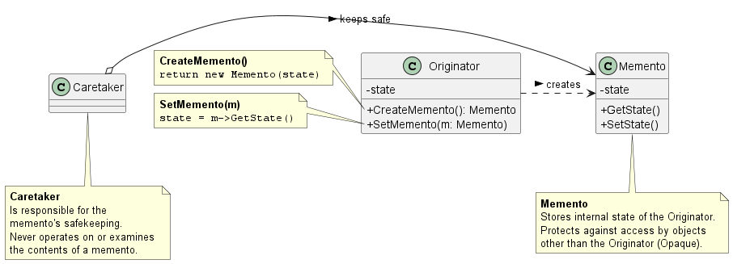

# 備忘錄模式 (Memento Pattern)

在維護大型系統或開發複雜的應用程式。例如：資料庫的 Transaction 回滾機制、文書處理軟體的復原 (Undo) / 重做 (Redo)功能，或是遊戲中的存檔 / 讀檔機制時，我們經常需要將系統某個時間點的狀態快照 (Snapshot)保存下來，以便未來發生錯誤或使用者反悔時能夠進行還原。

如果在保存狀態時，直接將物件內部的所有變數公開給外部系統讀取與儲存，這會嚴重破壞物件導向設計中最核心的*封裝性*。為了解決這個問題，**備忘錄模式 (Memento Pattern)** 提供了非常精妙的架構解法。

1. 備忘錄模式的核心概念

      **定義：** 在不違反封裝性的前提下，捕捉並將一個物件的內部狀態外部化，以便稍後能將該物件還原到此先前的狀態。

      備忘錄模式的運作機制非常像我們把貴重物品放進「保險箱」。系統中主要有三個核心角色：
      1. **Originator (發起人)：** 這是擁有核心資料的物件，它負責建立包含其當前內部狀態快照的備忘錄 (Memento)，並能使用該備忘錄來還原自己的狀態。
      2. **Memento (備忘錄)：** 負責儲存 Originator 內部狀態的物件。它具有嚴格的存取控制，對外它是*不透明的 (Opaque)*，只有建立它的 Originator 可以讀取裡面的資料。
      3. **Caretaker (管理員 / 保管者)：** 負責安全保管備忘錄的物件。它不知道備忘錄裡面存了什麼資料，也絕對不會去操作或檢查備忘錄的內容，它只負責在需要時將備忘錄交還給 Originator。

2. 背後支撐的核心設計原則

      備忘錄模式之所以能在架構中優雅地處理歷史狀態，是因為它深度實踐了以下兩個核心原則：

      1. 維持封裝性邊界 (Preserving Encapsulation Boundaries)
         * **模式體現：** 備忘錄模式避免了將 Originator 原本應該私有管理的資訊暴露給外界。透過為備忘錄設計兩種介面（給 Caretaker 看的「窄介面」，以及給 Originator 看的「寬介面」），系統能夠在不破壞封裝的前提下，讓外部物件安全地保管這些歷史狀態。

      2. 單一職責原則 (Single Responsibility Principle)
         * **模式體現：** 在沒有備忘錄模式的情況下，Originator 可能需要自己負責維護過去所有的歷史狀態清單。備忘錄模式將「保管狀態」的責任抽離出來，交給獨立的 Caretaker 來負責，這簡化了 Originator 的設計，幫助它維持高內聚力 (High Cohesion)，專注於處理核心的業務邏輯。
3. 備忘錄模式類別圖 (Class Diagram)

    

    運作流程解析：
    1. 當使用者請求*存檔*時，`Caretaker` 會向 `Originator` 請求一個備忘錄。
    2. `Originator` 執行 `CreateMemento()`，將自己當前的 `state` 打包進一個新的 `Memento` 物件中，並回傳給 `Caretaker`。
    3. Caretaker 將這個 `Memento` 好好保存起來（例如放進一個 Stack 堆疊中，用於支援多次 Undo）。
    4. 當需要*還原*時，Caretaker 將保管的 `Memento` 傳回給 Originator 的 `SetMemento()` 方法，Originator 取出狀態並覆蓋現有狀態，完成復原。

4. 總結

    引入備忘錄模式時，通常會提出以下警告與權衡 (Trade-offs)：

    1. **記憶體與儲存成本 (Storage and Performance Costs)：** 如果 Originator 的狀態包含極度龐大的資料結構，那麼每次建立備忘錄都會消耗大量的記憶體與 CPU 資源。如果使用者頻繁觸發存檔或系統記錄點，可能會引發記憶體耗盡 (OOM) 或是大幅降低系統效能。在 Java 等語言中，我們有時會運用*序列化 (Serialization)*技術來保存系統狀態以方便寫入硬碟。
    2. **增量儲存優化 (Incremental Changes)：** 為了解決上述的效能問題，如果狀態的改變是按照可預測的順序發生（例如指令的歷史記錄），實務上的備忘錄可以被設計成只儲存*增量變更（差異值, Diffs）*而非完整物件的拷貝。
    3. **隱藏的管理成本 (Hidden Costs in Caring)：** Caretaker 負責保管備忘錄，但它通常不知道備忘錄到底有多大。這意味著一個看似輕量的 Caretaker，可能會在不知不覺中佔用極大量的儲存空間，因此必須設計良好的過期淘汰機制，例如限制 Undo 的最大步數為 50 步。

5. 範例程式碼類別圖

    

    1. 封裝邊界 (Encapsulation)：
        * `Originator` 是唯一能存取 `Memento` 內容並將其轉化為狀態的類別。
        * `Memento` 在此實作中作為一個簡單的狀態容器。
    2. 狀態儲存：
        * `Originator` 透過 `saveStateToMemento()` 將當前狀態（如 "State #1"）打包成一個新的 Memento 物件。
        * `Originator` 透過 `getStateFromMemento(Memento memento)` 從特定的備忘錄中讀取回原有的狀態，實現「復原」功能。
    3. 職責分離 (Caretaker)：
        * `Caretaker` 僅負責*存*與*取*這些 Memento 物件（通常使用一個 List），它完全不知道備忘錄內部的具體狀態是什麼。這確保了狀態的安全性和物件之間的鬆散耦合。
    4. 歷史記錄管理：
        * 透過 `Caretaker` 內的列表，系統可以輕易實作多層次的復原 (Undo)功能（例如返回到 5 分鐘前的狀態）。
