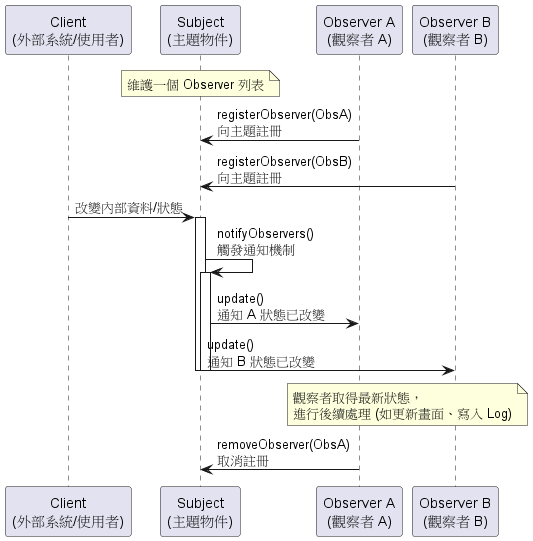
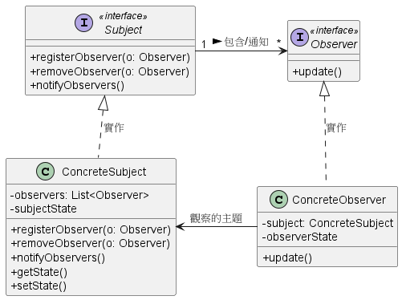
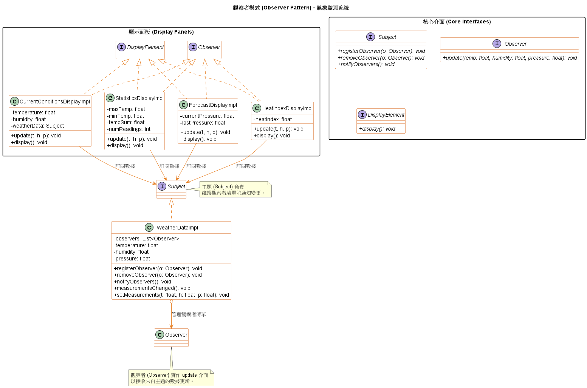

# 觀察者模式 (Observer Pattern)

在分散式系統、事件驅動架構（Event-Driven Architecture）或任何需要維持資料一致性的系統中，**觀察者模式 (Observer Pattern)** 是一個極度核心的底層架構。

它的核心定義非常明確：**定義物件之間的一對多依賴關係，當一個物件的狀態改變時，所有依賴它的物件都會自動收到通知並進行更新**。

你可以把它想像成現實生活中的「報紙訂閱機制」：

* **Subject（主題 / 發布者）：** 負責管理狀態與資料（就像報社）。
* **Observer（觀察者 / 訂閱者）：** 只要向 Subject 註冊，當有新資料或狀態改變時，就會自動收到通知。如果不想再收到通知，隨時可以取消註冊。

在現代系統架構中，這通常被稱為發布-訂閱 (Publish-Subscribe) 模型。

1. 系統運作流程圖 (PlantUML)

    為了讓初學者清楚理解它的動態運作邏輯，我們透過以下的循序圖來展示物件之間的互動：

    

    從架構來看，Subject 擁有狀態，且是資料的唯一擁有者；而多個 Observers 依賴該 Subject 在資料變動時通知它們。這產生了一個乾淨的設計，避免了讓多個物件共同控制同一份資料造成的混亂。

2. 觀察者模式背後的核心設計原則

    我們在評估架構時，看重的是系統是否容易擴充與維護。觀察者模式之所以強大，正是因為它完美體現了以下四大物件導向設計原則：

    1. 努力讓互動的物件之間保持「鬆耦合」 (Strive for loosely coupled designs between objects that interact) 
        這是觀察者模式最核心的精神。
        在鬆耦合的設計中，Subject 完全不需要知道 Observer 的具體類別是誰、在做什麼，它只知道對方實作了特定的 `Observer` 介面。這意味著：

            * 我們可以在執行時期 (Runtime) 隨時動態新增或移除觀察者。
            * 修改 Subject 或 Observer 的內部程式碼時，完全不會互相影響，因為它們之間的依賴被降到了最低。這讓系統在面對變動時具有極高的韌性。

    2. 找出應用程式中會變動的部分，並將其與不變的部分分開 (Encapsulate what varies)
        在觀察者模式中，會不斷變動的是「Subject 的內部狀態」以及「依賴這些狀態的 Observer 數量與型別」。我們將這些變動點封裝起來，使得未來無論是要增加新的觀察者，或是改變狀態，都不需要去修改 Subject 現有的通知邏輯。

    3. 針對介面寫程式，而不是針對實作寫程式 (Program to an interface, not an implementation)
        Subject 與 Observer 都依賴於抽象的介面。Subject 透過 `Observer` 介面（例如 `update()` 函式）來發送通知給所有訂閱者；而 Observer 也是透過 `Subject` 介面來進行註冊與註銷。這確保了高層次的抽象耦合。

    4. 多用合成，少用繼承 (Favor composition over inheritance)
        觀察者模式並沒有使用僵化的靜態繼承來建立依賴。相反地，它是在執行時期透過「合成 (Composition)」的方式，將任何數量的 Observer 動態地組合到 Subject 的通知名單中。

3. Push 模型 vs. Pull 模型

    在實作通知機制（也就是呼叫 `update()`）時，有一個非常經典的系統架構權衡：

    * **推模型 (Push Model)：** 當 Subject 狀態改變時，主動把所有詳細的資料當作參數「推」給 Observer。這可能導致傳送了一堆 Observer 根本不需要的冗餘資料，且當未來需要增加傳輸的新欄位時，必須修改所有 Observer 的 `update()` 介面。
    * **拉模型 (Pull Model)：** Subject 只發送一個極簡的通知（甚至沒有參數的 `update()`），告訴 Observer「狀態改變了！」。接著，Observer 根據自身的需求，主動呼叫 Subject 的 `getter` 方法將需要的資料「拉」回來。

    在建構易於維護的大型系統時，**拉模型 (Pull Model) 通常被認為是更正確、更具擴充性的作法**。它允許 Subject 未來自由擴充新狀態，而完全不需要去修改現有的 Observer 介面。

4. Observer Pattern 類別圖 (PlantUML)

    

    讓我們把這個類別圖拆解開來，看看每個元件在系統中負責什麼工作：

    1. **`Subject` (主題介面 / 發布者)**
        * **角色職責**：這是一個介面，定義了讓觀察者加入 (`registerObserver`)、退出 (`removeObserver`) 以及觸發通知 (`notifyObservers`) 的標準方法。
        * **架構意義**：對於想要訂閱資料的物件來說，它們只會看到這個介面，這確保了發布者與訂閱者之間的依賴性降到最低。

    2. **`Observer` (觀察者介面 / 訂閱者)**
        * **角色職責**：所有潛在的觀察者都必須實作這個介面。它通常只包含一個 `update()` 方法。
        * **架構意義**：當 Subject 的狀態改變時，它只知道要呼叫這個 `update()` 方法，完全不需要知道底層具體的觀察者是誰、在做什麼。這就是實現「鬆耦合 (Loose Coupling)」的關鍵。

    3. **`ConcreteSubject` (具體主題)**
        * **角色職責**：真正負責保存核心資料（State）與維護觀察者清單（通常是一個 List）的實體類別。
        * **運作邏輯**：當它的內部狀態發生改變（例如呼叫了 `setState()`），它就會執行 `notifyObservers()`，迴圈遍歷清單中的所有觀察者，並呼叫它們的 `update()` 方法來傳遞變更。

    4. **`ConcreteObserver` (具體觀察者)**
        * **角色職責**：實作了 `Observer` 介面的具體類別，通常它內部會持有指向 `ConcreteSubject` 的參考（Reference）。
        * **運作邏輯**：當收到 `update()` 的通知時，具體觀察者可能會主動去向 Subject 獲取最新的狀態（透過 `getState()`），然後同步更新自己的狀態或觸發後續的系統行為（如寫入日誌、更新畫面等）。

5. 範例程式碼類別圖

    