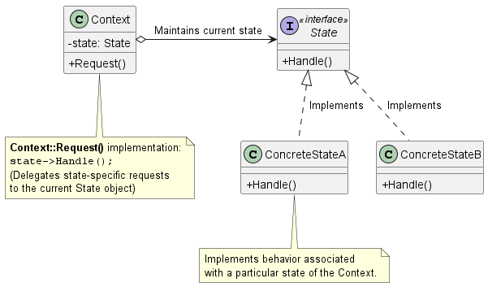
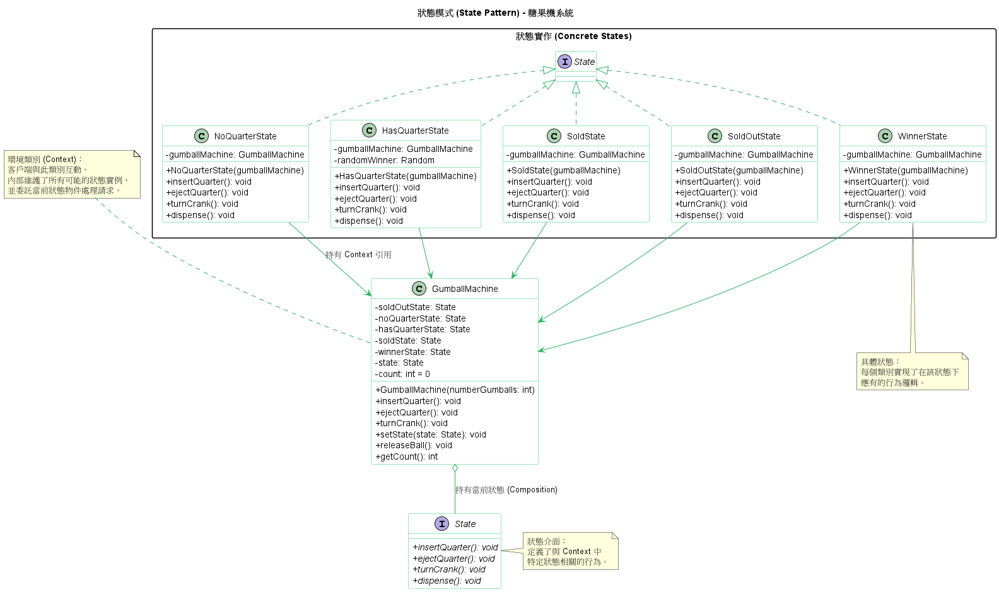

# 狀態模式 (State Pattern)

在設計底層的網路協定（例如：TCP 連線狀態的建立、監聽與關閉）、分散式任務排程器，或是複雜的業務生命週期（例如：訂單系統）時，我們不可避免地需要實作「狀態機 (State Machine)」。

如果採用傳統的做法，工程師往往會用一個整數或列舉 (Enum) 來代表狀態，然後在每一個方法裡塞滿龐大的 `if-else` 或 `switch` 條件判斷式。這種做法在面臨需求變更（例如新增一個狀態）時，會引發牽一髮動全身的維護災難，極易產生 Bug。

為了解決這個痛點，**狀態模式 (State Pattern)** 應運而生。

1. 狀態模式的核心概念

    **定義：** 允許一個物件在其內部狀態改變時，改變它的行為。從外部客戶端的角度來看，這個物件就像是改變了它的類別一樣。

    簡單來說，狀態模式將系統中每一種*狀態*都提升為一個擁有完全物件地位的*獨立類別*。主體物件（我們稱為 Context）不再自己處理狀態的判斷邏輯，而是將這些工作*委派 (Delegate)*給代表當前狀態的物件來處理。當內部狀態需要發生轉換時，Context 只需要將它所持有的狀態物件替換成另一個狀態物件即可。

2. 背後支撐的核心設計原則

    狀態模式之所以能寫出高彈性且易於維護的程式碼，是因為它深度實踐了多項關鍵的物件導向設計原則：

    * **封裝變動的部分 (Encapsulate what varies)：** 系統中會變動的是*在不同狀態下的具體行為*。我們將這些與特定狀態相關的行為局部化，各自抽取並封裝到獨立的狀態類別中。
    * **多用合成，少用繼承 (Favor composition over inheritance)：** Context 物件不透過繼承來獲得行為，而是透過*合成 (Composition)*的方式持有一個 `State` 介面的實例。這讓它能在執行時期 (Runtime) 透過抽換該實例來動態改變自身的行為。
    * **開放封閉原則 (Open-Closed Principle)：** 當系統需要增加全新的狀態時，我們只需要新增一個實作了 State 介面的新類別即可，完全不需要去修改原本 Context 的程式碼，也不用修改其他的狀態類別。
    * **單一職責原則 (Single Responsibility Principle)：** 每個狀態類別只有一個職責，就是處理該狀態下的合法行為與狀態轉換邏輯。這徹底消除了混亂的巨型條件判斷式。

3. 狀態模式類別圖 (Class Diagram)

    

    系統角色拆解：
    * **Context (環境 / 狀態機主體)：** 定義了客戶端 (Client) 感興趣的介面。它內部維護了一個指向具體狀態物件的參考 (`state`)，代表當前的狀態。
    * **State (狀態介面)：** 定義了一個共同介面，用來封裝與 Context 某個特定狀態相關的行為。
    * **ConcreteState (具體狀態類別)：** 每一個子類別都實作了在某個特定狀態下的具體行為。

4. 總結

    狀態模式有幾個關鍵的權衡 (Trade-offs) 需要特別注意：

    1. **狀態轉換邏輯該放在哪裡？**
        狀態的切換可以由 `Context` 負責，也可以由各個 `ConcreteState` 負責。一般來說，如果狀態的轉換是固定不變的，可以放在 Context 裡；但如果狀態的轉換是動態的（例如依照庫存數量或網路連線回傳的封包來決定），讓各個狀態類別自行決定下一個狀態會是更有彈性的作法。
    2. **類別數量激增的代價：**
        採用狀態模式會無可避免地增加系統中的類別數量。但這是為了將複雜狀態明確化 (Explicit) 所必須付出的代價，這遠比未來維護上千行的 `if-else` 上帝物件 (God Object) 來得划算。
    3. **狀態物件的共用與資源優化：**
        如果你的狀態物件內部不需要維護自己的狀態變數（也就是它僅包含行為，沒有 Instance Variables），那麼這些狀態物件就可以被多個 Context 執行個體安全地共用。在實務上，我們經常會將這些狀態類別結合**享元模式 (Flyweight)** 或實作成為**單例 (Singleton)** 以節省記憶體開銷。

5. 範例程式碼類別圖

    

    1. 封裝變化的行為：糖果機的各種行為（投幣、退幣、轉動搖桿）都被封裝在具體的 State 實作類別中。當機器狀態改變時，GumballMachine 只需要將請求委託給不同的狀態物件即可。

    2. 雙向關聯：
        * GumballMachine 持有所有狀態物件的實例，以便進行狀態切換。
        * 具體狀態物件（如 `NoQuarterState`）持有一個指向 `GumballMachine` 的引用，這樣狀態物件才能呼叫 `Context` 的方法（如 `setState()`）來驅動狀態轉換。

    3. 消除複雜邏輯：此模式解決了在 `GumballMachine` 類別中原本可能存在的繁瑣 `if (state == SOLD_OUT) ... else if ... `邏輯，使系統更容易擴充，例如增加一個幸運中獎狀態 WinnerState。

    4. 符合開放封閉原則：若要增加新的狀態，只需新增一個 State 實作類別，而不需要修改現有狀態類的邏輯。

