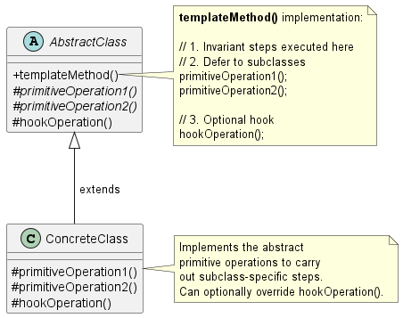
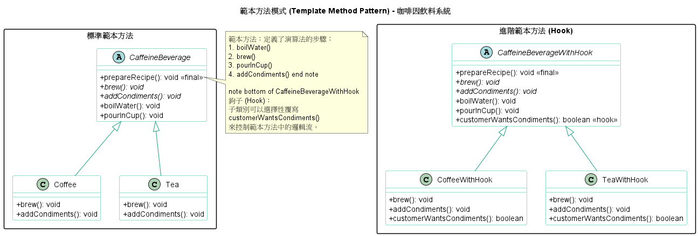

# 樣板方法模式 (Template Method Pattern)

在開發大型系統架構、建構底層框架（Framework）或是設計複雜的演算法時，我們經常會遇到一個狀況：**多個任務有著完全相同的「核心執行流程」，但在某些特定步驟的實作細節上有所不同。**

如果把這些流程重複寫在各個類別中，不僅會造成嚴重的程式碼重複（Code Duplication），未來如果要修改核心流程，就必須去改動所有類別，這是極高的維護風險。為了解決這個問題，我們引進了**樣板方法模式 (Template Method Pattern)**。

1. 樣板方法模式的核心概念

    **定義：** 在一個方法中定義一個演算法的骨架，並將一些步驟的實作推遲（Defer）到子類別中。樣板方法讓子類別在不改變演算法結構的前提下，能夠重新定義演算法的某些特定步驟。

    **系統工程師的白話文比喻：**
    這就像是我們在建立標準作業流程 (SOP)。假設我們設計了一套「資料處理演算法」，它的標準步驟是：
    1. 讀取資料 (Read Data)
    2. **處理資料 (Process Data) -> 每種業務邏輯不同**
    3. 寫入資料庫 (Write to DB)

    在樣板方法模式中，我們會在一個抽象基底類別 (Abstract Class) 中寫好這個 SOP 方法（這就是 Template Method），而且通常會將其標記為 `final` 以防止子類別竄改核心流程。接著，我們將第 2 步宣告為「抽象方法 (Abstract Method)」，強制各個具體的子類別自己去實作這個步驟。

2. 背後的核心設計原則

    樣板方法模式之所以是框架設計中最常被使用的模式之一，是因為它完美實踐了以下重要原則：

    1. 好萊塢原則 (The Hollywood Principle)
        * **原則定義：** 「別打電話給我們，我們會打給你 (Don't call us, we'll call you)」。
        * **架構意義：** 這是為了防止系統出現「依賴腐敗 (Dependency Rot)」。在樣板方法中，高階的抽象類別（定義演算法骨架的地方）掌握了絕對的控制權，它只會在需要時去呼叫低階子類別所實作的方法。低階模組絕對不會主動呼叫高階模組，這讓系統的相依性變得非常乾淨且單向。

    2. 程式碼最大化重用 (Code Reuse)
        * 將演算法中*不變 (Invariant)*的部分集中在單一的超級類別中，子類別只負責實作*會變動*的行為。這大幅降低了維護成本。

    3. 擴充掛鉤 (Hooks) 的彈性機制
        * 除了必須實作的抽象方法外，樣板方法通常會提供*掛鉤 (Hooks)*。這是一個在抽象類別中預設為空（或具有預設行為）的方法。子類別可以*選擇性*覆寫 (Override) 它，藉此在演算法的特定時間點插入額外的邏輯，或是透過回傳布林值來影響演算法的走向。

3. 樣板方法模式類別圖 (Class Diagram)

    

    角色拆解與運作流程：
      * **`AbstractClass` (抽象類別)：** 定義了演算法的骨架 `templateMethod()`。這個方法通常會被保護起來（例如在 Java 中宣告為 `final`）以防止結構被破壞。它內部會呼叫其他的 `primitiveOperation()`。
      * **`ConcreteClass` (具體類別)：** 繼承了抽象類別，並且被強迫實作所有的 `primitiveOperation()` 以補齊演算法中缺失的拼圖。
      * **`hookOperation()` (掛鉤方法)：** 給予子類別極大的彈性。如果子類別不實作，就直接使用父類別的預設空行為。

4. 總結

    與我們之前討論過的策略模式 (Strategy Pattern)相比，這兩者都在封裝演算法，但手段截然不同：
    * **策略模式 (Strategy)** 使用**物件合成 (Composition)** 來抽換*一整個完整的演算法*，彈性最高，可以在執行期間動態切換。
    * **樣板方法 (Template Method)** 則是依賴**類別繼承 (Inheritance)**，將演算法*部分步驟*的實作交給子類別。它更專注於演算法內部結構的統一控管與避免重複程式碼。

    在 Java 的 API 中，例如集合框架的 `AbstractList` 或是陣列排序的 `Arrays.sort()` (概念上的應用)，都大量運用了樣板方法的精神來建構底層框架。

    雖然範本方法和策略模式都用於封裝演算法，但它們的實現方式和意圖截然不同。

    | 特性 (Feature) | 範本方法模式 (Template Method Pattern) | 策略模式 (Strategy Pattern) |
    | :--- | :--- | :--- |
    | **主要機制** | **繼承**：透過子類別來實作演算法中的步驟。 | **組合**：透過將行為物件組合到 Context 中，實現可替換的演算法系列。 |
    | **演算法控制** | 抽象父類別擁有演算法的完整控制權和不變結構。 | Context 將演算法的實作完全委派給策略物件。 |
    | **意圖** | 定義並保護演算法的骨架，實現程式碼的高度重用（將公共邏輯上移）。 | 讓演算法可以獨立於使用它的客戶端而自由變化。 |

    * **與工廠方法模式 (Factory Method) 的關係：**
      * 工廠方法模式可以被視為範本方法模式的一個特例（或稱特化），其中範本方法的「原始操作」被用於建立和返回物件。

5. 範例程式碼

    

    1. 抽象類別 (Abstract Class)：CaffeineBeverage 扮演核心角色。它定義了 final 的 prepareRecipe() 方法，確保演算法的結構（步驟順序）不會被子類別修改。
    2. 原語操作 (Primitive Operations)：如 brew() 與 addCondiments()，這些方法在父類別中是抽象的，強制子類別根據自身特性（coffee 或 tea）提供具體實作。
    3. 具體步驟 (Concrete Operations)：如 boilWater() 與 pourInCup()，這些是對所有子類別都相同的行為，直接在父類別實作以達到程式碼復用。
    4. 鉤子 (Hook)：在 CaffeineBeverageWithHook 中，customerWantsCondiments() 提供了一個預設行為（通常回傳 true）。子類別可以視需求覆寫它，從而干預範本方法的執行邏輯（例如：詢問使用者是否要加糖）。
