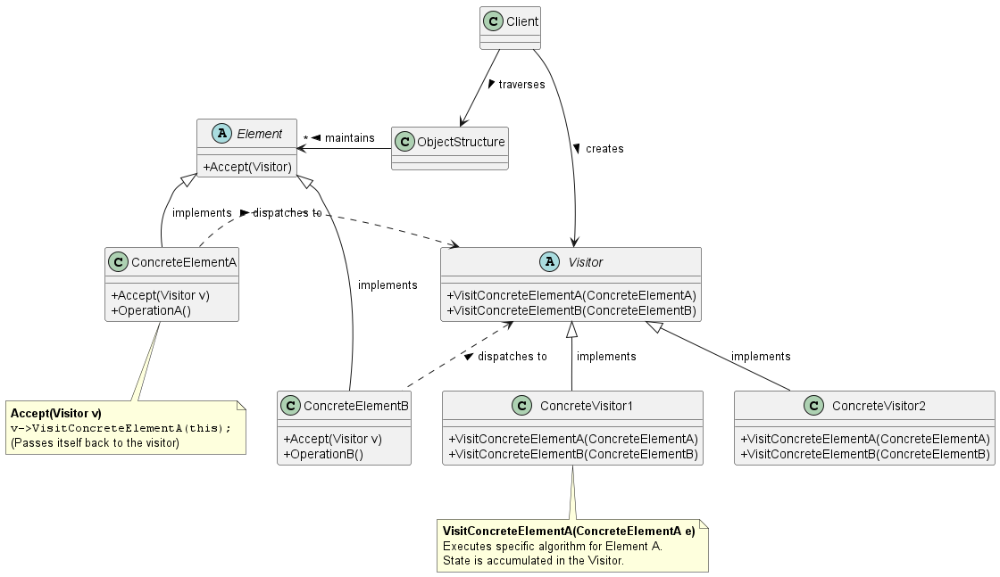
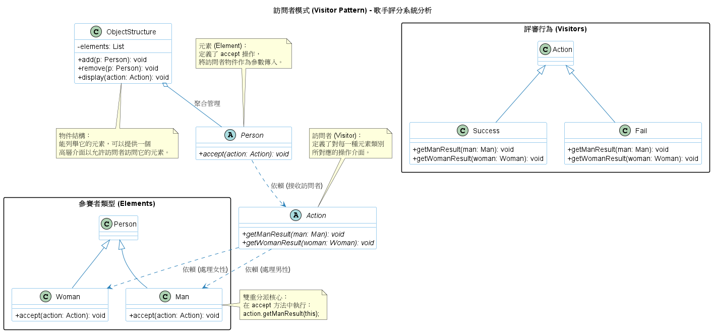

# 訪問者模式 (Visitor Pattern)

在開發編譯器 (Compiler)、靜態程式碼分析工具、或是處理龐大的複合資料結構（例如大型基礎設施的設定檔目錄或語法樹）時，我們經常會遇到一個痛點：**我們需要對這些結構中的各種節點執行許多不相關的操作（例如：型別檢查、輸出報表、產生程式碼），但我們不想把這些邏輯全部塞進資料節點的類別裡面，導致類別變得極度臃腫且難以維護**。

為了解決這個問題，**訪問者模式 (Visitor Pattern)** 提供了一個非常優雅的底層架構解法。

1. 訪問者模式的核心概念

      **定義：** 表示一個作用於某物件結構中的各元素之操作。訪問者模式讓你能定義一個新操作，而不需要去改變那些接收該操作的元素類別。

      **白話文比喻：**
         想像一間大型企業（物件結構 / Object Structure）裡面有工程師、業務、人資等不同的員工（具體元素 / Concrete Elements）。今天政府要派人來做「消防安檢」，明天可能要派人來做「勞檢」。如果我們不用 `Visitor` 模式，就等於是要在每種員工的標準工作手冊（類別）裡面，新增「配合消防安檢」和「配合勞檢」的流程，這會讓員工的工作手冊變得非常混亂。導入訪問者模式後，員工只需要學會一個動作*接待 (Accept)*。當消防員 (Visitor)來的時候，員工把自己交給消防員，消防員就會依照該員工的特性執行相對應的檢查。這樣一來，未來就算新增了衛生檢查，員工的類別也完全不需要修改。

      在程式架構中，元素透過提供一個 `Accept(Visitor)` 介面來接待訪問者，並在內部反向呼叫訪問者身上的專屬處理方法（這稱為雙重分派），將自己當作參數傳遞給訪問者。

2. 背後支撐的核心設計原則

      訪問者模式的底層架構，高度依賴並展現了以下幾項關鍵的設計原則：

      1. 開放封閉原則 (Open-Closed Principle)
         * **模式體現：** 完美實踐了對擴充開放、對修改封閉。如果物件結構（例如 AST 語法樹的節點）非常穩定，但需要頻繁新增不同的操作，Visitor 模式讓你只需要新增一個 Visitor 的子類別，而完全不用修改現有的 Element 類別。

      2. 單一職責原則 (Single Responsibility Principle) 與 集中化管理
         * **模式體現：** 將*資料結構*與*對資料的操作行為*徹底分離。它將相關的行為，例如：系統中所有的型別檢查邏輯集中在單一個 `TypeCheckingVisitor` 類別中，而不是散落在數十個不同的節點類別裡。任何演算法特定的狀態，都可以安全地隱藏在 Visitor 內部。

      3. 雙重分派 (Double Dispatch)
         * **模式體現：** 這是 Visitor 模式運作的魔法基礎。在單一分派 (Single-dispatch) 語言如 Java 或 C++ 中，被執行的操作僅取決於請求的名稱與接收者的型別。但訪問者模式透過兩次呼叫（先由 Element 呼叫 `Accept(Visitor v)`，接著 Element 內部再反向呼叫 `v.VisitElement(this)`），讓最終執行的邏輯同時取決於「Visitor 的型別」與「Element 的型別」。

      架構權衡 Trade-offs:
      * **封裝性的破壞：** 為了讓 Visitor 能順利取得所需的資料來完成操作，Element 通常被迫公開大量的內部狀態，這打破了物件導向的封裝性 (Encapsulation)。
      * **新增 Element 的夢魘：** 如果系統的 Element 類別層級很穩定，用 Visitor 很棒；但如果系統**經常需要新增新的 Element 子類別**，那 Visitor 模式會是個災難，因為每新增一個 Element，你就必須去修改 Visitor 介面與所有具體的 Visitor 實作。

3. 訪問者模式類別圖 (Class Diagram)

   

   系統角色拆解與運作流程：
   * **`Visitor` (訪問者介面)：** 為物件結構中的每一個 `ConcreteElement` 宣告一個 `Visit...` 操作。方法的名稱與參數會標示出該訪問者現在正在訪問哪個具體的元素類別。
   * **`ConcreteVisitor` (具體訪問者)：** 實作 `Visitor` 宣告的操作。每個操作實作演算法的一小部分，這些邏輯通常會在走訪過程中不斷累積狀態。
   * **`Element` (元素介面)：** 定義一個 `Accept` 操作，該操作必須接收一個 `Visitor` 作為參數。
   * **`ConcreteElement` (具體元素)：** 實作 `Accept` 操作。標準做法是直接呼叫訪問者身上對應自己型別的方法`v->VisitConcreteElement(this)`。
   * **`ObjectStructure` (物件結構)：** 通常是一個集合或是複合模式 (Composite) 構成的樹狀結構。它負責提供一個高階介面，讓訪問者能夠走訪其底下的所有元素。

   總結來說，當你的系統設計中，**資料的結構 (Classes)相對穩定，但資料的操作處理 (Operations)卻日新月異**，請果斷採用 Visitor 模式，讓你的資料節點回歸乾淨。

4. 範例程式碼類別圖

      

      1. 雙重分派 (Double Dispatch)：
         * 當呼叫 `person.accept(action)` 時，會發生兩次動態決定：
            * 決定 person 的具體類型（是 Man 還是 Woman）。
            * 在 `accept` 方法內部呼叫 `action.get...Result(this)`，決定 action 的具體類型（是 Success 還是 Fail）。
      2. 資料與邏輯分離：
         * Person 階層（Man/Woman）只負責維持資料結構與基本的元素身分。
         * Action 階層（Success/Fail）封裝了所有複雜的評價邏輯。
      3. 靈活性 (Flexibility)：
         * 如果想增加一個*待定 (Pending)*的評價，只需新增一個 `Pending` 類別繼承 `Action` 並實作兩個方法，完全不需要修改 Man 或 Woman 的程式碼。
      4. 穩定性要求：
         * 此模式適用於*資料結構穩定（Man 和 Woman 很少會變成第三種性別）*但*作業邏輯經常變動*的系統。
