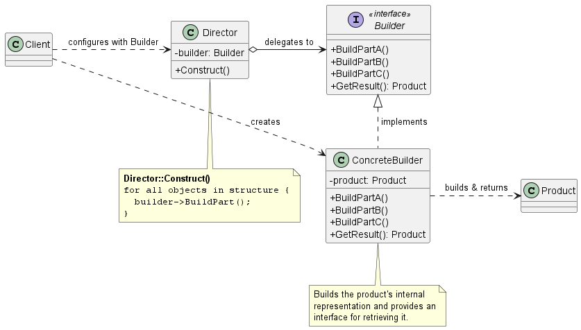
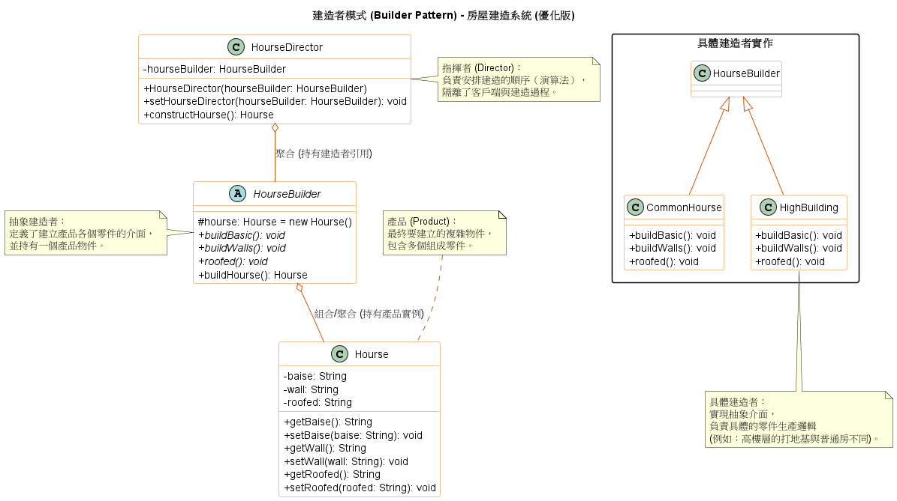

# 建造者模式 (Builder Pattern)

在建構複雜的系統物件，例如：需要掛載多種安全協定的網路連線物件、解析複雜的 RTF 轉換文件、或是規劃包含飯店與機票的旅遊行程時，如果我們把所有的組裝邏輯與細節都塞在一個巨大的建構子 (Constructor) 裡面，程式碼會變得極度混亂且難以維護。

為了解決這個問題，**建造者模式 (Builder Pattern)** 提供了一種優雅的架構設計。

1. 建造者模式的核心概念

    **定義：** 將一個複雜物件的建構過程與它的具體表示分離，使得同樣的建構過程可以建立出不同的表示方式 (Separate the construction of a complex object from its representation so that the same construction process can create different representations)。

    簡單來說，建造者模式將物件的*製作步驟*交給一個稱為**指揮者 (Director)** 的角色來控管，而*每個步驟的具體實作*則交給**建造者 (Builder)** 來完成。這樣一來，同樣的指揮流程，只要換上不同的建造者，就能生產出完全不同的複雜產品。

2. 背後支撐的核心設計原則

    我們重視架構的解耦與擴充性。建造者模式完美體現了以下幾個物件導向設計原則：

    1. 封裝變動的部分 (Encapsulate what varies)
    在系統中，複雜物件的*內部結構*與*如何被組裝出來的細節*是經常變動的。建造者模式將這些會變動的建構與表示邏輯封裝在具體的建造者中，藉此提高模組化程度，並向客戶端隱藏產品的內部結構。

    2. 針對介面寫程式，而不是針對實作寫程式 (Program to an interface, not an implementation)
    指揮者 (Director) 只依賴抽象的 `Builder` 介面來指示建構步驟，完全不知道背後具體是哪一個類別在進行實作。這讓我們只要抽換不同的具體建造者（例如將 `ASCIIConverter` 換成 `TeXConverter`），就能在不修改指揮者程式碼的情況下，產生不同的內部表示。

    3. 單一職責原則 (Single Responsibility Principle)
    建造者模式將*決定建構步驟的流程邏輯*與*真正實作組裝細節的邏輯*徹底分離。每個類別專注於自己的單一職責，避免了龐大的上帝類別 (God Class) 產生。

3. 建造者模式類別圖 (Class Diagram)

    

    系統角色拆解與運作流程：
    * **`Builder` (抽象建造者介面)：** 指定了建立 `Product` 物件各個零件的抽象介面。
    * **`ConcreteBuilder` (具體建造者)：** 實作 `Builder` 介面，負責實際建構並組裝產品的各個零件。它會追蹤自己建立的表示方式，並提供一個（例如 `GetResult()`）取得最終產品的方法。
    * **`Director` (指揮者)：** 透過 `Builder` 介面來建構物件。它負責控制建構的「步驟與順序」。
    * **`Product` (產品)：** 代表正在被建構的複雜物件。
    * **運作流程：** 客戶端 (Client) 建立一個 Director 並配置一個期望的 ConcreteBuilder；接著 Director 依照固定流程呼叫 Builder 的組裝方法；最後，客戶端直接向 Builder 索取建構完成的產品。

4. 總結

    在進行架構設計時，很多工程師會把 **建造者模式 (Builder)** 跟 **抽象工廠模式 (Abstract Factory)** 搞混，因為它們都在負責建立複雜物件。

    我們區分它們的核心在於**控制的精細度**：
    * **Abstract Factory** 的重點在於建立*一系列相關的產品家族*。工廠通常在一個步驟（One shot）內就把產品建立出來並立即回傳。
    * **Builder** 的重點則在於**一步一步 (step by step)**地建構出一個複雜的物件。產品的建構是在 Director 的細緻控制下進行的，直到所有組裝步驟都完成後，Builder 才會在最後一個步驟交出最終產品。這賦予了系統工程師對建構過程與內部結構極高的控制權。

5. 範例程式碼類別圖

    

    1. 零件與整體的解耦：`Hourse` 物件（產品）的組成零件（地基、牆、屋頂）與其建造演算法完全分離。

    2. 指揮者 (Director) 的角色：在 `HourseDirector` 中，`constructHourse()` 方法封裝了蓋房子的步驟順序。客戶端只需要告訴指揮者*我想要哪種建造者*，指揮者就會負責把房子蓋好。

    3. 靈活性與擴充性：如果需要增加一種新的建築類型，例如別墅，只需新增一個繼承 `HourseBuilder` 的具體實作類別即可，不需要修改 `HourseDirector` 或 `Hourse` 的代碼，符合開閉原則。

    4. 精細控制：相較於傳統的建構子，建造者模式允許一步步建立物件，並在最後一刻（`buildHourse()`）才獲取完整的產品實體。
