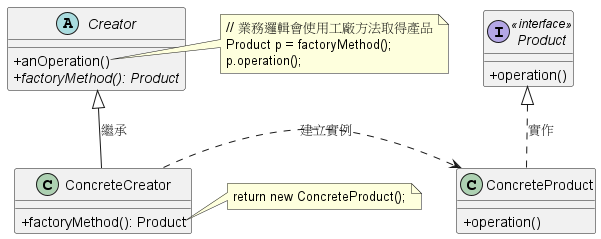
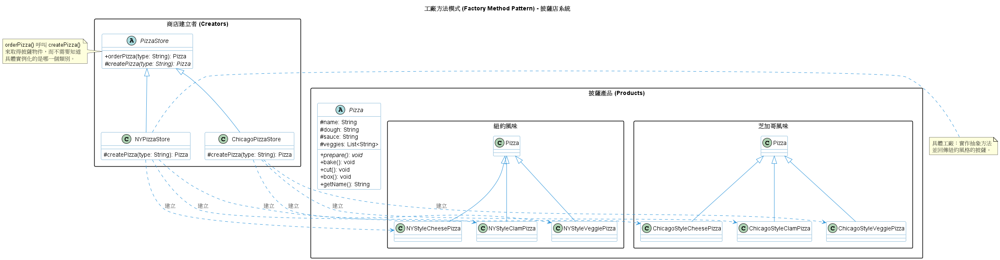
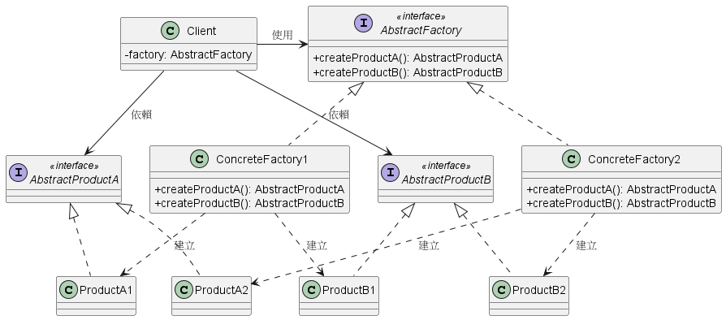

# 工廠模式 (Factory Pattern)

在我們建構大型分散式系統、微服務架構，或是設計底層的基礎設施時，經常會遇到一個大問題：「如何優雅地建立物件？」

在程式碼中到處使用 `new` 關鍵字（例如 `new MySQLConnection()`），會讓高階的業務邏輯死死地綁在低階的具體實作上。當系統需要擴充或抽換底層元件時，我們就會面臨修改大量程式碼的噩夢。為了解決這個問題，**工廠模式 (Factory Pattern)** 應運而生。

工廠模式主要分為兩種正式的設計模式：**工廠方法模式 (Factory Method Pattern)** 與 **抽象工廠模式 (Abstract Factory Pattern)**。

1. 背後的核心設計原則

    工廠模式之所以強大，是因為它們完美實踐了以下幾個重要的物件導向設計原則：

    * 依賴反轉原則 (Dependency Inversion Principle, DIP)
        這是工廠模式的靈魂。原則指出：**依賴抽象，不要依賴具體類別**。高階模組（例如訂單處理系統）不應該依賴低階模組（例如特定的資料庫連線實作），兩者都應該依賴於*抽象（介面）*。工廠模式幫我們把*實例化具體類別*的動作抽離，讓高階模組只需依賴抽象的產品介面。

    * 封裝變動的部分 (Encapsulate what varies)
        在系統中，*建立物件*通常是很容易變動的行為（例如根據不同環境建立不同的設定檔）。我們將這些建立物件的程式碼抽離並封裝到「工廠」中，保護原本的業務邏輯不受影響。

    * 針對介面寫程式，而不是針對實作寫程式 (Program to an interface, not an implementation)
        透過工廠回傳抽象介面，客戶端（Client）完全不需要知道背後具體是哪一個類別被建立出來。

2. 工廠方法模式 (Factory Method Pattern)

    **定義：** 定義一個建立物件的介面，但由子類別決定要實例化哪一個類別。工廠方法讓類別把實例化（Instantiation）的動作推遲到子類別中進行。

    **系統應用視角：** 我們提供一個框架（Framework），高層級的流程已經固定，但把*具體要產生什麼產品*交給繼承的子類別來決定。

3. 工廠方法模式類別圖

  

  **角色說明：**

    * **Product:** 所有產品必須實作的共同介面。
    * **Creator:** 抽象建立者，包含了依賴抽象產品的業務邏輯 (`anOperation()`)，以及一個抽象的工廠方法 (`factoryMethod()`)。
    * **ConcreteCreator:** 實作工廠方法，決定真正要實例化哪一個具體產品。

4. 範例程式碼類別圖

    

## 抽象工廠模式 (Abstract Factory Pattern)

**定義：** 提供一個介面，用來建立「相關或相依物件的家族（Families of products）」，而不需要指定它們的具體類別。

**系統應用視角：** 
    當你的系統需要支援「多套主題」或「多種平台的組合」時，這非常有用。例如：遊戲引擎需要同時支援 Windows 與 Mac，Windows 需要一套 (UI元件, 渲染引擎, 音效引擎)，而 Mac 需要另一套。抽象工廠確保我們在 Windows 環境下，創造出來的都是 Windows 家族的元件，不會發生「Windows 視窗配上 Mac 按鈕」的錯誤。

1. 抽象工廠模式 - 類別圖 (PlantUML)

  

  **角色說明：**

    * **AbstractFactory:** 定義創建「一整組」相關產品的方法。
    * **ConcreteFactory:** 實作創建具體家族產品的邏輯。Client 在執行期只會被組合成其中一個具體工廠。
    * **Client:** 只依賴抽象工廠與抽象產品的介面，完全不知道底層產生了什麼具體物件。

## 總結這兩者的差異？

1. **實作方式：** 工廠方法使用**類別繼承 (Class Inheritance)**，透過子類別來處理物件建立；抽象工廠使用**物件組合 (Object Composition)**，提供一個建立產品家族的介面，將工廠物件注入到 Client 中。
2. **目的不同：** 工廠方法主要為了解決*單一產品*的實例化問題；抽象工廠則是為了解決*一系列相關產品（家族）*的建立問題，確保產品之間的一致性。

無論使用哪一種，它們的最終目的都是**將「物件的使用」與「物件的建立」徹底解耦**。這能讓我們的系統具備極佳的彈性，輕鬆應對未來未知模組的擴充需求。
