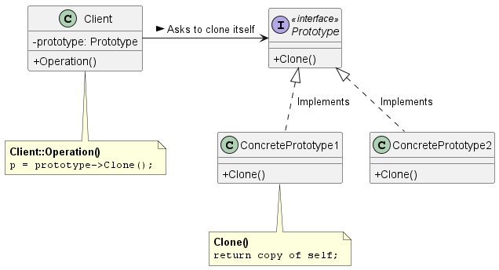
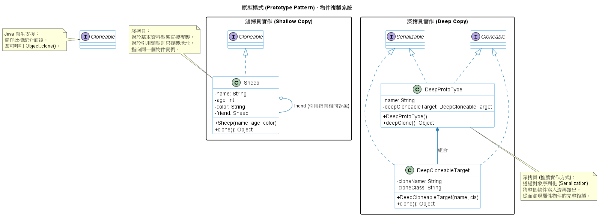

# 原型模式 (Prototype Pattern)

在建構雲端基礎設施、開發遊戲引擎，或是處理「建立成本極高」的複雜物件，例如：從資料庫載入大量設定、或是經過複雜運算才成型的物件時，我們常遇到效能與系統耦合度的挑戰。

這時，**原型模式 (Prototype Pattern)** 就是我們優化系統架構與記憶體管理的絕佳利器。

1. 原型模式的核心概念

      **定義：** 使用原型實例來指定要建立的物件種類，並透過拷貝（Copying / Cloning）這個原型來建立新的物件。

      **白話文比喻：**
         這就像是雲端工程師在部署伺服器時的*虛擬機器映像檔 (VM Image)*。當你需要啟動 100 台設定相同的 Web Server 時，你不會每一台都從安裝作業系統、下載套件、設定環境變數從頭開始做（這成本太高、太複雜了）。相反地，你會先完美地設定好一台機器作為*原型 (Prototype)*，接著直接*拷貝 (Clone)*這台機器的狀態來瞬間產生出 100 台新的伺服器。

      在程式架構中也是如此。當客戶端需要一個新物件，但該物件的建立過程過於昂貴或複雜時，我們不使用 `new` 關鍵字從頭實例化，而是呼叫現有物件的 `clone()` 方法，直接複製出一個一模一樣的新物件。

2. 背後支撐的核心設計原則

      原型模式之所以能在複雜系統中發揮極大作用，是因為它實踐了以下幾個核心設計原則：

      1. 隱藏建立物件的複雜度 (Hide Creation Complexities)
         * **模式體現：** 對客戶端隱藏了建立新實例的複雜過程與細節。客戶端甚至可以在*不知道具體型別*的情況下產生物件，它只需要知道這個物件支援拷貝即可。

      2. 減少子類別化 (Reduced Subclassing)
         * **模式體現：** 使用傳統的工廠方法 (Factory Method) 時，通常會產生一個與產品階層平行的*建立者 (Creator) 階層*。原型模式讓你直接向原型要求拷貝自己，完全消滅了對於龐大工廠子類別階層的需求。

      3. 針對介面寫程式 (Program to an interface, not an implementation)
         * **模式體現：** 系統中會將依賴關係建立在 `Prototype` 這個高階介面上。這使得客戶端系統可以在執行時期 (Run-time) 動態載入、安裝或移除原型，而不需要重新編譯程式碼。

3. 原型模式類別圖 (Class Diagram)

      

      系統角色拆解與運作流程：
      * **`Prototype` (原型介面)：** 宣告了一個用來拷貝自己的介面 (`Clone()`)。
      * **`ConcretePrototype` (具體原型)：** 真正實作拷貝自身操作的物件。在 Java 中這通常代表實作了 `Cloneable` 介面或是實作了自訂的深拷貝邏輯。
      * **`Client` (客戶端)：** 透過要求原型拷貝自身來建立一個新的物件。

4. 總結

   1. **淺拷貝 (Shallow Copy) vs. 深拷貝 (Deep Copy) 的災難：**
      這是實作原型模式最困難且最容易出 Bug 的地方。如果你的物件內部包含指向其他物件的參考（指標），預設的淺拷貝只會複製指標，導致*原本的物件*與*複製出的物件*共用底層資料。一旦修改，系統就會發生連鎖崩潰。如果物件結構複雜（甚至包含循環參考 Circular References），你必須花費極大心力實作深拷貝，或是透過*將物件序列化 (Serialization) 再反序列化 (Deserialization)*的方式來取得乾淨的副本。
   2. **原型管理器 (Prototype Manager) 的應用：**
      在大型系統（例如遊戲引擎中的怪物生成器）中，原型的數量通常不是固定的，可以被動態建立和銷毀。實務上我們會建立一個*原型管理器 (Registry / Manager)*，它本質上是一個 `Hash Map`。客戶端不用自己保管原型，而是向 Manager 給定一個 Key（例如 `"Level5_Dragon"`），Manager 就會找出對應的怪物原型並 Clone 一份出來給你。這讓系統獲得了不寫死任何程式碼就能擴充新物件的強大彈性。

5. 範例程式碼類別圖

      

      1. 標記介面 (Marker Interface)：在 Java 中，原型模式的核心是實作 `java.lang.Cloneable`。這是一個標記介面，用來告知 JVM 該物件允許被複製。

      2. 淺拷貝 (Shallow Copy)：
         * 在 `Sheep` 類別中。當我們複製 `Sheep` 時，其內部的 `friend` 屬性（也是 `Sheep` 類型）僅複製了引用地址。
         * 這表示原物件與克隆物件會共享同一個 friend 實例，修改其中一個會影響另一個。

      3. 深拷貝 (Deep Copy)：
         * 在 `DeepProtoType` 類別中。為了徹底隔離原物件與新物件，專案中使用了兩種方式：
            * 手動對所有引用屬性呼叫 `clone()`。
            * 利用 `Serializable` 進行物件序列化與反序列化。這種方式即使物件結構非常複雜（巢狀層次多），也能自動完成所有層級的複製。
      4. 效益：
         * 原型模式比直接使用 `new` 關鍵字建立物件更有效率，特別是當物件初始化過程非常昂貴（如需要查詢資料庫或執行大量計算）時。
         * 它簡化了物件建立的過程，且隱藏了複雜物件的建立細節。
