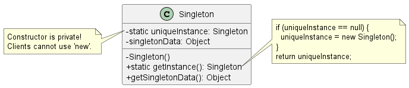

# 單例模式 (Singleton Pattern)

在建構高併發的後端服務或底層系統時，我們經常需要管理昂貴或絕對唯一的系統資源，例如：資料庫連線池 (Connection Pool)、執行緒池 (Thread Pool)、系統快取 (Cache)、或是全域的設定檔管理員。

如果這些物件在系統中被實例化 (Instantiate) 多次，不僅會造成嚴重的資源浪費，還可能導致程式行為異常或資料不一致。為了解決這個問題，**單例模式 (Singleton Pattern)** 是我們最常用來管控系統唯一資源的經典設計。

1. 單例模式的核心定義

    **定義：** 確保一個類別只有一個實例 (Instance)，並提供一個全域的存取點 (Global point of access) 來取得該實例。

    簡單來說，單例模式就是把「建立物件的權力」收回到類別自己身上。它不允許外部程式碼使用 `new` 關鍵字來隨意建立物件，而是要求外部統透過類別提供的一個靜態方法（通常命名為 `getInstance()`）來索取這個唯一的實例。

2. 單例模式類別圖

    注意它是如何透過「私有建構子 (Private Constructor)」和「靜態變數 (Static Variable)」來達成控制的：

    

    **架構拆解：**
    * **`uniqueInstance` (靜態變數)：** 用來儲存該類別唯一的一個實例。
    * **`Singleton()` (私有建構子)：** 宣告為 `private`，徹底阻絕外部系統透過 `new Singleton()` 建立新物件的可能性。
    * **`getInstance()` (靜態方法)：** 這是全域唯一的存取點。當外部需要此物件時，只能呼叫 `Singleton.getInstance()`。如果實例還沒被建立，它會先建立並儲存起來；如果已經建立過了，就直接回傳該實例。

3. 背後的設計原則與架構權衡

    雖然單例模式看似簡單，但從系統工程的角度來看，它其實牽涉到幾個重要的設計原則與權衡 (Trade-offs)：

    1. 延遲實例化 (Lazy Instantiation) 與資源控管
        傳統的全域變數 (Global Variables) 通常會在應用程式一啟動時就將物件建立好。如果該物件非常耗費記憶體，但系統執行過程中卻遲遲沒有用到它，這對 SRE 來說是非常浪費資源的。單例模式的 `getInstance()` 採用了「延遲實例化」的技巧：**只有在系統第一次真正呼叫它時，物件才會被建立**，這大幅優化了系統啟動時的效能與記憶體使用率。

    2. 封裝性 (Encapsulation)
        它完美封裝了「物件如何被建立」以及「何時被建立」的邏輯。客戶端 (Client) 不需要知道資源建立的細節，只需要跟單例索取資源即可。

    3. 違反「單一職責原則 (Single Responsibility Principle, SRP)」的妥協
        這是在進行架構審查 (Architecture Review) 時常被提出來的點。單例模式其實讓一個類別同時承擔了「兩個」職責：第一是管理自己的實例建立（確保唯一性），第二則是它原本該負責的核心業務邏輯（例如管理資料庫連線）。但在實務上，為了確保系統資源的絕對單一，這個妥協是普遍被接受的。

4. 多執行緒 (Multithreading) 挑戰

    對於初學者來說，上面的標準單例模式看起來很完美；但對於維護高併發系統的工程師來說，**這個寫法在多執行緒環境下是致命的**。

    如果兩個執行緒 (Thread A 與 Thread B) 同時呼叫 `getInstance()`，且當時 `uniqueInstance` 還是 `null`，它們可能會同時進入 `if` 判斷式，結果導致系統在記憶體中建立了**兩個**不同的實例，徹底打破了單例的原則。

    **實務上的解決方案：**
    1. **加鎖 (Synchronized)：** 將 `getInstance()` 宣告為同步方法。缺點是會大幅拖慢效能（可能慢 100 倍），因為每次讀取都要排隊。
    2. **急切實例化 (Eager Instantiation)：** 如果系統一定會用到該物件，直接在宣告靜態變數時就 `new` 出來（交由 JVM 在載入類別時保證執行緒安全）。
    3. **雙重檢查鎖定 (Double-Checked Locking)：** 利用 `volatile` 關鍵字，先檢查實例是否存在，若不存在才進入同步區塊 (Synchronized block) 進行建立。這能將效能衝擊降到最低。
    4. **使用 Enum (現代 Java 最佳實踐)：** 透過 Java 內建的 Enum 類型來實作單例，不僅語法極度簡潔，還能由 JVM 底層免費幫你處理多執行緒同步、防範反射 (Reflection) 攻擊與序列化 (Serialization) 問題。

總結來說，單例模式是你系統中確保*唯一真理來源 (Single Source of Truth)*的強大武器，但在實作時務必將多執行緒的併發問題考慮

## 單例模式實作

### 1. 經典的單例模式實作方法

其關鍵組成如下：

* **私有建構子 (Private Constructor)**：將建構子宣告為 `private`，這是為了防止外部程式碼透過 `new` 關鍵字直接建立該類別的實例。只有該類別內部可以進行實例化。
* **私有靜態變數 (Private Static Variable)**：在類別內部宣告一個 `private static` 的變數，用來持有那個唯一的實例。這個變數是屬於類別本身，而非物件。
* **公開靜態存取方法 (`getInstance()`)**：提供一個 `public static` 的方法（通常命名為 `getInstance()`），作為外界取得唯一實例的統一窗口。這個方法的邏輯是：
    1. 檢查靜態變數是否為 `null`（即實例尚未建立）。
    2. 如果為 `null`，則在方法內部使用私有建構子建立一個新實例，並將其指派給靜態變數。
    3. 回傳該靜態變數所持有的實例。

### 2. 多執行緒環境下的挑戰與解決方案

經典的單例實作在單執行緒環境下運作良好，但在多執行緒環境下會出現問題。當兩個執行緒同時判斷 `uniqueInstance == null` 為真時，它們可能會各自建立一個實例，從而破壞了單例的唯一性。

書中提出了幾種解決方案來應對這個挑戰：

1. **同步 `getInstance()` 方法 (Synchronized Method)**：
    * **做法**：直接在 `getInstance()` 方法上加上 `synchronized` 關鍵字。
    * **優點**：簡單有效，能確保執行緒安全 (thread-safe)。
    * **缺點**：同步會帶來顯著的效能開銷，可能降低效能達 100 倍。而且，只有在第一次建立實例時才需要同步，後續的呼叫中，同步就變成了不必要的負擔。

2. **立即實例化 (Eager Instantiation)**：
    * **做法**：在宣告靜態變數時就直接建立實例，而不是等到 `getInstance()` 被呼叫時才建立。
    * **優點**：利用 JVM 在載入類別時的機制來保證執行緒安全，且沒有同步的效能問題。
    * **缺點**：失去了延遲實例化的好處。如果物件建立成本高昂，或者應用程式不一定會用到這個實例，就會造成資源浪費。

3. **雙重檢查鎖定 (Double-Checked Locking)**：
    * **做法**：首先檢查實例是否存在，如果不存在，才進入一個同步區塊。在同步區塊內再次檢查實例是否存在，若仍不存在，才建立實例。
    * **優點**：在實例建立後，後續的呼叫不會進入同步區塊，大幅降低了效能開銷。
    * **注意**：這個方法需要搭配 `volatile` 關鍵字來確保多執行緒環境下變數的可見性。同時，書中特別提醒，這個方法在 Java 1.4 及更早的版本中是無效的。

### 3. Java 中更現代且建議的實作方式：`enum`

使用 `enum`（列舉）來實作單例模式。

* **做法**：宣告一個只有一個元素的 `enum`。
* **優點**：這是目前在 Java 中實作單例模式最簡單且最安全的方式。它能自動處理多執行緒問題，並且還能防止透過反射 (reflection) 或序列化/反序列化 (serialization/deserialization) 破壞單例的唯一性。
