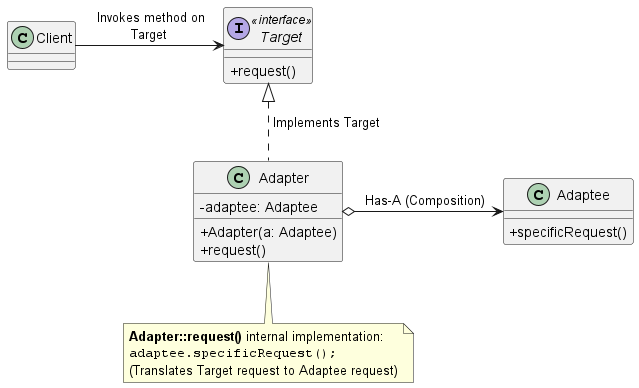

# 轉接器模式 (Adapter Pattern)

在維護大型系統或整合第三方服務時，我們經常會遇到一個痛點：**現有的系統（Client）期望使用某種特定的介面，但我們剛引進的新函式庫、舊有遺留系統（Legacy System）或微服務，卻提供了完全不相容的介面**。為了讓它們協同工作，我們不能（或不想）去修改已經穩定運作的舊有程式碼，也無法修改第三方提供的封閉程式碼。

為了解決這個介面不相容的難題，**轉接器模式 (Adapter Pattern)** 提供了最經典的架構解法。

1. 轉接器模式的核心概念

    **定義：** 轉接器模式將一個類別的介面，轉換成另一個客戶端所期望的介面。轉接器讓原本因為介面不相容而無法合作的類別，能夠一起運作。

    你可以把它想像成現實生活中的電源轉接頭。當你帶著美國規格的筆記型電腦到英國出差時，英國的牆壁插座介面與你的筆電插頭不相容。此時，你需要一個 AC 電源轉接器，它扮演著中間人的角色，接收英國插座的電力，並轉換成你筆電所期望的電力介面。

    在軟體系統中，轉接器（Adapter）同樣扮演著這個中間人（Middleman）的角色：它攔截客戶端發出的請求，並將其轉換成另一個被轉接者（Adaptee）能夠理解的方法呼叫。

2. 轉接器模式背後的設計原則

    之所以大量採用轉接器模式，是因為它完美體現了以下幾個核心的物件導向設計原則：

    1. **針對介面寫程式，而不是針對實作寫程式 (Program to an interface, not an implementation)：** 
        客戶端（Client）只會看到並依賴目標介面（Target Interface），完全不知道背後實際負責處理的是哪一個具體類別。這讓我們未來可以隨時抽換不同的轉接器與底層系統，而客戶端程式碼連一行都不用改。
    2. **多用合成，少用繼承 (Favor composition over inheritance)：** 
        在實務上最常用的物件轉接器 (Object Adapter)中，轉接器類別並不是用繼承的方式來取得舊系統的行為，而是透過*合成 (Composition)*的方式，在內部持有一個被轉接者（Adaptee）的實例。這種設計賦予了極大的彈性，讓我們可以用同一個轉接器來搭配被轉接者的任何子類別。
    3. **開放封閉原則 (Open-Closed Principle)：**
        當我們需要整合新的廠商 API 時，我們不需要修改現有的系統程式碼，只需*新增*一個轉接器類別來封裝介面轉換的邏輯即可，做到了對擴充開放、對修改封閉。

3. 轉接器模式類別圖 (Class Diagram)

    在設計轉接器模式時，主要分為兩種：使用多重繼承的*類別轉接器 (Class Adapter)*，以及使用合成的*物件轉接器 (Object Adapter)*。由於許多現代語言（如 Java）不支援多重繼承，因此「物件轉接器」是我們最常使用的架構。

    

    角色拆解與運作流程：
    * **Target (目標介面)：** 定義了 `Client` 所期望的領域特定介面。
    * **Client (客戶端)：** 針對 `Target` 介面撰寫邏輯的現有系統。它發出請求，但不知道有轉接器的存在。
    * **Adaptee (被轉接者)：** 這是擁有我們需要的功能，但介面與系統不相容的既有類別（例如新引進的第三方函式庫）。
    * **Adapter (轉接器)：** 這個類別實作了 `Target` 介面，並在內部持有一個 `Adaptee` 的參考。當 `Client` 呼叫 `request()` 時，`Adapter` 會負責將這個請求「翻譯」或轉發為 `Adaptee` 身上的 `specificRequest()` 呼叫。

    總結來說，當你在維護系統時，發現舊系統與新功能套件的介面搭不起來，請不要直接去動原始程式碼。插入一個轉接器（Adapter），讓它去處理那些骯髒的介面轉換工作，你的系統架構將會維持乾淨與高彈性。

4. 與其他模式的關係

    * **與裝飾者模式 (Decorator) 的區別**：兩者都涉及包裹物件。但轉接器模式的**意圖**是改變介面，而裝飾者模式的意圖是增加新的行為和職責，但不改變介面。
    * **與代理模式 (Proxy) 的區別**：轉接器改變了被包裹物件的介面，而代理模式則實作與其實體物件相同的介面，其目的是控制存取。
