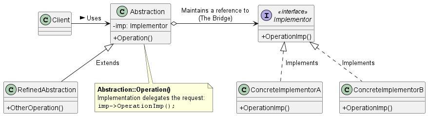
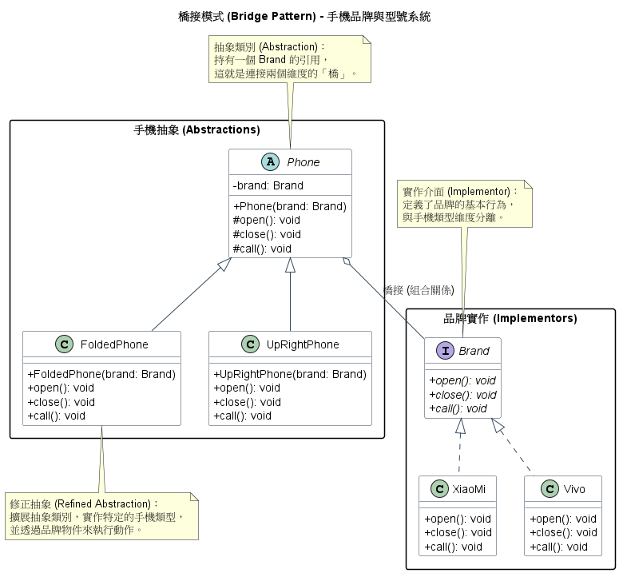

# 橋接模式 (Bridge Pattern)

在開發跨平台系統，例如同一套軟體要同時支援 Windows, Mac, Linux、或是設計具有多個變化維度的大型架構時，如果我們單純依靠繼承 (Inheritance)來處理不同的實作，往往會造成「類別爆炸 (Class Explosion)」的維護噩夢。

為了解決這個問題，**橋接模式 (Bridge Pattern)** 提供了一種極具彈性與擴充性的底層架構。

1. 橋接模式的核心概念

    **定義：** 將抽象部分與它的實作部分分離，使它們都可以獨立地變化 (Decouple an abstraction from its implementation so that the two can vary independently)。

    **白話文比喻與痛點場景：**
    假設我們要設計一套通用型的電視遙控器系統。系統包含不同的遙控器型號（如基礎版、進階版），同時也要支援不同的電視廠牌（如 Sony, RCA）。
    如果使用傳統的繼承，我們可能會為基礎版遙控器繼承出 Sony基礎版遙控器與 RCA 基礎版遙控器。當未來加入新的遙控器型號或新的電視廠牌時，類別的數量會呈現乘積般地暴增。

    橋接模式的解法是：**將遙控器的邏輯 (Abstraction)與電視廠牌的具體控制 (Implementation)徹底拆分為兩個獨立的類別階層**。這兩個階層之間透過一個橋樑 (Bridge) 也就是物件合成 (Object Composition) 來連接。這樣一來，客戶端只需對抽象的遙控器操作，而遙控器會將請求委派給底層具體的電視實作。

2. 橋接模式背後的設計原則

    橋接模式之所以強大，是因為它完美體現了以下三個核心的物件導向設計原則：

    1. 多用合成，少用繼承 (Favor object composition over class inheritance)
        * **架構意義：** 繼承會在編譯時期將實作與抽象永久綁死 (Permanent binding)，使得系統僵化。橋接模式透過「合成 (Composition)」，讓抽象類別內部持有一個指向實作介面 (`Implementor`) 的參考。這賦予了系統在執行時期 (Runtime) 動態配置或抽換實作的極大彈性。

    2. 針對介面寫程式，而不是針對實作寫程式 (Program to an interface, not an implementation)
        * **架構意義：** 高階的抽象類別 (`Abstraction`) 只會呼叫實作介面 (`Implementor`) 所定義的通用方法，完全不知道底層具體是哪一家廠牌的實作。這消除了編譯時期的相依性，當實作細節改變時，完全不需要重新編譯抽象類別與客戶端程式碼。

    3. 開放封閉原則 (Open-Closed Principle)
        * **架構意義：** 抽象與實作被徹底解耦後，兩邊的類別階層都可以獨立地進行擴充。你可以增加新的遙控器介面，也可以增加新的電視實作，而這一切都不會影響到另一邊現有的程式碼。

3. 橋接模式類別圖 (Class Diagram)

    

    角色拆解與運作流程：
    * **`Abstraction` (抽象介面)：** 定義了高階的介面，並且維護一個指向 `Implementor` 物件的參考。
    * **`RefinedAbstraction` (擴充抽象介面)：** 擴充了 `Abstraction` 所定義的介面（例如進階版遙控器加入了「上一台」的功能）。
    * **`Implementor` (實作介面)：** 定義底層實作類別的通用介面（例如電視的開關、轉台）。這個介面不需要與 `Abstraction` 的介面一致，通常 `Implementor` 只提供基本操作，而 `Abstraction` 則基於這些基本操作定義更高階的業務邏輯。
    * **`ConcreteImplementor` (具體實作)：** 實作 `Implementor` 介面的具體類別（例如具體的 Sony 或是 RCA 電視控制邏輯）。

4. 總結

    在架構設計時，會把橋接模式 (Bridge)跟轉接器模式 (Adapter)搞混，因為它們看起來都在兩個物件之間提供了一層*間接性 (Indirection)*並轉發請求。

    它們的核心差異在於**介入的時機與意圖**：
    * **轉接器模式 (Adapter)** 是事後補救：當系統已經設計好，但你發現兩個現有的介面不相容時，你寫一個 Adapter 讓它們能一起運作。
    * **橋接模式 (Bridge)** 則是事前規劃：在系統設計之初，你就預見到某個功能在「抽象介面」與「底層實作」都有可能獨立發展，因此你主動用 Bridge 將它們切開，以確保未來的擴充性。

5. 範例程式碼類別圖

    

    1. 分離維度 (Dimensional Separation)：
        * 手機類型：折疊式 (FoldedPhone)、直立式 (UpRightPhone) 是產品的一個維度。
        * 手機品牌：小米 (XiaoMi)、Vivo (Vivo) 是另一個維度。
        * 橋接模式讓這兩個維度各自由 Phone (抽象) 與 Brand (實作) 進行管理。
    2. 組合優於繼承 (Composition over Inheritance)：
        * 如果不使用橋接模式，則需要為每個品牌建立對應的機型類別（如 XiaoMiFoldedPhone, VivoFoldedPhone...），會導致子類別數量激增。
        * 透過 Phone 持有 Brand 的引用（聚合關係），系統只需 $M+N$ 個類別，而非 $M \times N$ 個。
    3. 靈活性：
        * 如果想增加一個滑蓋式手機，只需繼承 Phone 即可。如果您想增加一個華為品牌，只需實作 Brand 即可。兩者的擴充完全互不干擾。
