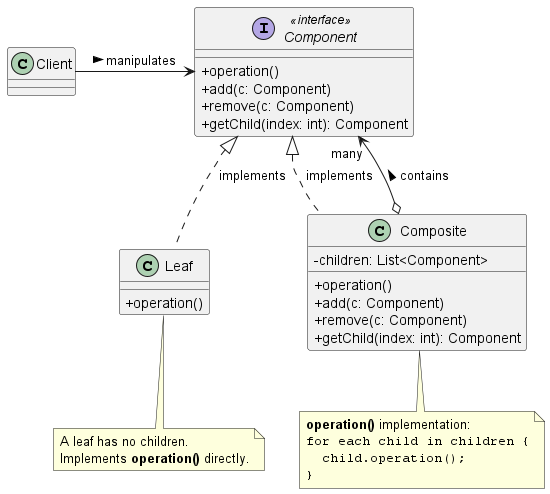
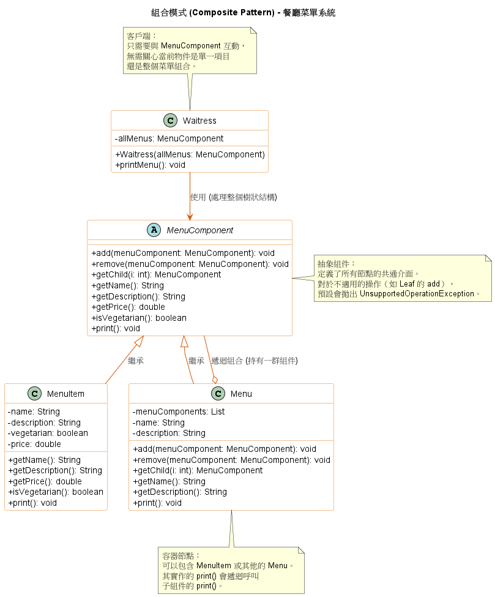

# 組合模式 (Composite Pattern)

在處理複雜的基礎架構（例如：檔案系統的目錄與檔案、網頁的 DOM 樹、或是組織架構的權限控管）時，我們經常會面對一種「樹狀結構」的資料。在這些結構中，包含了「容器（如資料夾）」與「單一元件（如檔案）」。

如果系統在走訪這些元件時，必須寫大量的 `if-else` 或 `instanceof` 來判斷「現在遇到的是資料夾還是檔案？」，程式碼將會變得極度臃腫且難以維護。為了解決這個問題，**組合模式 (Composite Pattern)** 提供了一個非常優雅的底層架構。

1. 組合模式的核心概念

    **定義：** 組合模式允許將物件組合成「樹狀結構」來表現「部分-整體 (part-whole)」的階層關係。它讓客戶端（Client）能夠以一致的方式（Uniformly）來處理個別物件與組合起來的物件。

    簡單來說，組合模式會定義一個共同的介面（Component），讓*單一節點 (Leaf)*與*複合節點 (Composite)*都實作這個介面。
    對客戶端而言，它不需要知道現在操作的是一個沒有子節點的單一物件，還是一個包含了成千上萬個子節點的巨大容器，客戶端只需要呼叫同一個方法（例如 `print()` 或 `execute()`），複合節點就會自動將這個呼叫遞迴往下傳遞給所有的子節點。

2. 組合模式的類別圖 (Class Diagram)

    

    **架構角色拆解：**
    * **Component (元件介面)：** 為所有參與組合的物件宣告統一的介面，包含核心的行為（如 `operation()`）以及子節點管理功能（如 `add()`、`remove()`）。
    * **Leaf (葉節點 / 單一物件)：** 代表樹狀結構中的最末端節點，它沒有子節點，負責執行真正的實體行為。
    * **Composite (複合節點 / 容器)：** 代表擁有子節點的元件。它的 `operation()` 實作通常是迴圈走訪所有的子節點，並呼叫它們的 `operation()`（遞迴執行）。

3. 背後支撐的核心設計原則與架構權衡

    從系統工程的角度來看，組合模式的設計非常特別，它其實是**用一個原則的妥協，來換取另一個架構上的巨大優勢**。

    1. 以單一職責原則 (Single Responsibility Principle)換取透明性 (Transparency)
        * 在標準的物件導向設計中，我們被教導一個類別應該只有一個改變的理由。然而，在組合模式的 `Component` 介面中，我們卻同時定義了核心操作行為 (`operation`)與子節點管理行為 (`add`, `remove`)。
        * **工程權衡 (Trade-off)：** 如果我們把子節點管理行為只放在 `Composite` 中，客戶端就必須先判斷該物件是不是 `Composite` 才能新增子節點，這喪失了統一處理的便利性。組合模式選擇讓 `Leaf` 也繼承這些管理方法（即使 `Leaf` 不能有子節點，通常只能拋出例外或無作用），以此換取對客戶端的**絕對透明性 (Transparency)**。客戶端可以完全盲目地對任何節點進行操作，不需寫任何 `if-else` 或轉型邏輯。

    2. 針對介面寫程式，而不是針對實作寫程式 (Program to an interface, not an implementation)
        * 整個系統中，Client 只認識最頂層的 `Component` 介面。這讓系統未來如果要擴充全新種類的 `Leaf` 或 `Composite`，現有的客戶端程式碼完全不需要修改，展現了極好的擴充性。

4. 總結

    當你在系統中大規模應用樹狀結構與組合模式時，有兩個實務上的地雷需要注意：
    1. **無限遞迴的效能問題：** 如果你的樹狀結構極度龐大，最頂層的一呼叫會引發連鎖反應。在某些情境下，可以考慮在 `Composite` 實作**快取 (Caching)** 機制（例如快取子節點的總數或運算結果），以避免重複進行昂貴的樹狀走訪。
    2. **子節點的型別限制安全問題：** 為了追求透明性，`Component` 介面允許任何元件加入結構中。如果你需要嚴格限制「某種資料夾只能裝特定類型的檔案」，這種設計會讓編譯器無法幫你把關，你必須在執行時期 (Runtime) 自己寫邏輯來檢查與攔截。

5. 範例程式碼類別圖

    

    1. 一致性介面 (Transparency)：`MenuComponent` 定義了所有的操作。這讓客戶端 `Waitress` 可以一致地對待「單一項目的菜單項」與「包含多個項目的菜單」，而不需要在程式碼中區分它們。

    2. 樹狀結構 (Tree Structure)：透過 Menu 類別內部的 `List<MenuComponent>`，系統可以構建無限深度的樹狀架構（例如：午餐菜單包含甜點菜單，甜點菜單內再包含具體的甜點項目）。

    3. 部分與整體 (Part-Whole)：組合模式讓客戶端能以相同的方式處理個別物件（MenuItem）與物件的組合（Menu），這正是此模式的核心目標。

    4. 異常處理：`MenuComponent` 選擇對不適用的方法拋出異常。這是一種權衡：雖然犧牲了型別安全（Leaf 可能會呼叫到 add），但獲得了最高的透明度。
