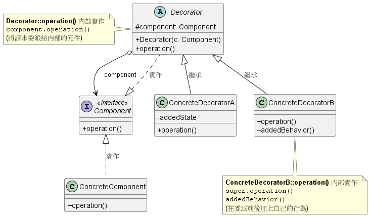
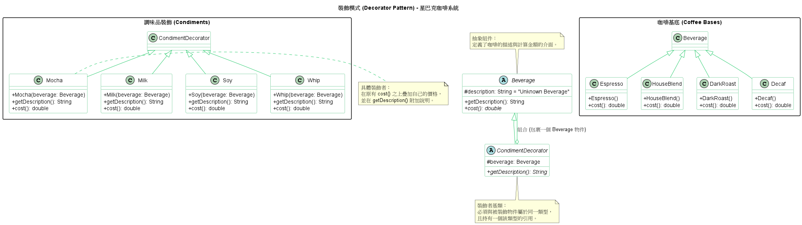

# 裝飾者模式 (Decorator Pattern)

在建構複雜的系統或處理多變的業務邏輯時，我們經常面臨需要為現有物件「動態添加新功能」的情境。如果單純依靠傳統的繼承 (Inheritance) 來擴充，隨著功能排列組合的增加，系統很快就會陷入難以維護的「類別爆炸 (Class Explosion)」。

**裝飾者模式 (Decorator Pattern)** 正是為了解決這個問題而生。它允許你在執行時期 (Runtime) 動態地為物件加上額外的責任與行為，提供了一種比建立子類別 (Subclassing) 更具彈性的功能擴充替代方案。

1. 裝飾者模式的核心運作機制

    你可以將裝飾者模式想像成「俄羅斯娃娃」或「包裝紙 (Wrapper)」。
    裝飾者物件會將真正的核心元件「包裝」起來。因為裝飾者與被裝飾的物件擁有相同的超型態 (Supertype / 介面)，所以在客戶端 (Client) 眼中，操作裝飾者跟操作原本的元件是一模一樣的，這稱為「透明圍籬 (Transparent Enclosure)」。

    當客戶端發出請求時，裝飾者會攔截這個請求，它可以在將請求「委派 (Delegate)」給內部真正的元件之前或之後，加入自己專屬的行為與邏輯。

    *實務範例：* 系統中最經典的裝飾者應用就是 Java 的 I/O 串流設計。當你需要效能優化時，會用 `BufferedInputStream` 去包裝 `FileInputStream`；若需要讀取 Zip 檔，再用 `ZipInputStream` 繼續往外包裝。

2. 背後支撐的核心設計原則

    裝飾者模式之所以強大，是因為它完美體現了以下幾個物件導向與系統架構的核心原則：

    1. 開放封閉原則 (Open-Closed Principle, OCP)
        * **原則定義：** 類別應該對擴充開放，對修改封閉。
        * **模式體現：** 當我們需要加入新功能時，完全不需要去修改底層已測試穩定、正在線上運行的現有程式碼。我們只需寫一個新的裝飾者類別將原本的物件包起來即可。這確保了系統的高穩定性與韌性。

    2. 多用物件合成，少用繼承 (Favor composition over inheritance)
        * **原則定義：** 透過將物件組合在一起來獲得新行為，而不是靠繼承父類別。
        * **模式體現：** 繼承是一種靜態的關聯，在編譯時期 (Compile time) 就被綁死了。裝飾者模式利用物件合成 (HAS-A)，讓我們能在系統執行期間 (Runtime) 動態地決定要加上幾個、哪幾種裝飾者，賦予系統極大的彈性。

    3. 針對介面寫程式 (Program to an interface, not an implementation)
        * **模式體現：** 裝飾者必須與被裝飾的元件實作相同的介面。這樣一來，無論物件外面包了多少層裝飾者，對使用該物件的客戶端程式碼而言，型別依然一致，不需要做任何修改。

3. 裝飾者模式類別圖 (Class Diagram)

    

    * **Component (抽象元件)：** 定義了物件的介面，可以是介面或抽象類別。
    * **ConcreteComponent (具體元件)：** 核心的基礎物件，也是我們準備要動態加上新行為的目標。
    * **Decorator (裝飾者抽象類別)：** 維護一個指向 Component 的參考，並實作與 Component 相同的介面。
    * **ConcreteDecorator (具體裝飾者)：** 真正負責加上新狀態或行為的實作類別。它會在呼叫內部 component 的操作前或後，執行額外的邏輯。

4. 總結

    * **優點：** 提供了一種「隨用隨付 (Pay-as-you-go)」的彈性架構，你不需要在基礎類別中把所有可能的功能都實作進去，避免了龐大臃腫的上帝類別 (God Class)。
    * **缺點與風險：** 過度使用裝飾者會導致系統在執行期產生「大量相似的小物件 (Lots of little objects)」。這些物件僅在互相串接的順序上有所不同，這會增加系統初始化的複雜度，並且當線上系統發生問題需要追蹤 (Trace) 或除錯 (Debug) 時，過長的方法委派鏈 (Call stack) 會讓工程師感到非常頭痛。

5. 範例程式碼類別圖

    

