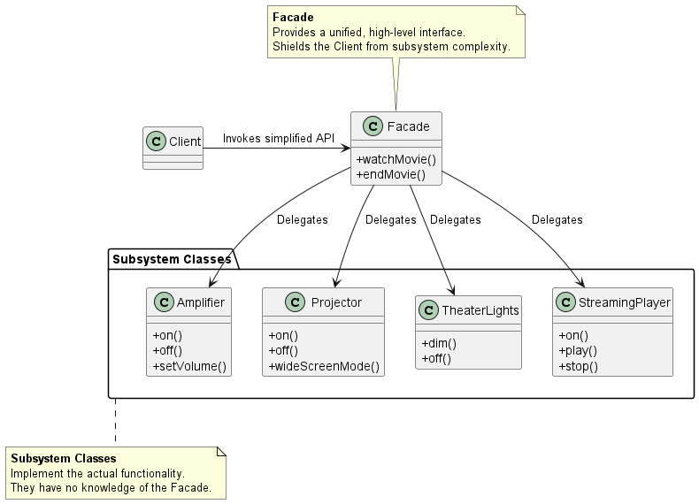
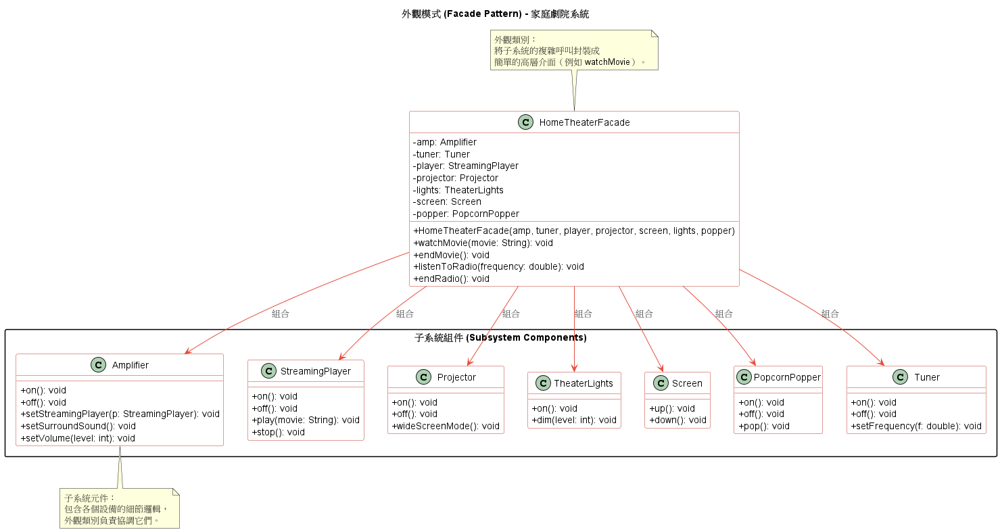

# 外觀模式 (Facade Pattern)

在架構大型微服務、維護複雜的底層基礎設施或整合多個第三方 API 時，我們經常會遇到一個痛點：**底層系統太過複雜，導致客戶端（Client）需要與大量的內部元件互動，造成極高的系統耦合度。**

為了解決這個問題，**外觀模式 (Facade Pattern)** 提供了最直覺且強大的架構解法。

1. 外觀模式的核心概念

    **定義：** 外觀模式為子系統中的一組介面提供一個統一的介面。外觀定義了一個更高階的介面，使得子系統變得更容易使用。

    你可以把它想像成家庭劇院的萬用遙控器或是微服務架構中的 API Gateway。如果沒有外觀模式，當客戶端想要看電影時，它必須親自去打開螢幕、打開投影機、打開音響、設定音量、調暗燈光、啟動播放器... 這要求客戶端必須非常了解所有底層元件的運作細節。引入外觀模式後，我們建立一個 `Facade` 類別，裡面提供一個簡單的 `watchMovie()` 方法。客戶端只需要呼叫這個方法，由 `Facade` 來負責在背後指揮所有複雜的子系統元件。

2. 支撐該模式的核心設計原則

    外觀模式之所以在系統工程中如此重要，是因為它完美實踐了一個關鍵的物件導向與架構原則：

    **最少知識原則 (Principle of Least Knowledge) / 迪米特法則 (Law of Demeter)**
    * **原則定義：** 只和你的密友談話 (Talk only to your immediate friends)。
    * **工程視角解釋：** 在設計系統時，我們應該盡量減少物件之間的互動數量。如果客戶端直接呼叫子系統中的 10 個不同類別，這表示客戶端與這 10 個類別產生了強耦合。任何子系統元件的修改，都會導致客戶端程式碼需要重構。
    * **模式體現：** 透過引入 `Facade` 作為中間人，客戶端現在只有一個朋友（也就是 `Facade`）。這大幅降低了系統的相依性與維護成本，同時也避免了牽一髮動全身的脆弱架構。

3. 外觀模式類別圖 (Class Diagram)

    

    角色拆解與運作流程：
    * **Facade (外觀 / 統一介面)：** 知道哪些子系統類別負責處理請求，並將客戶端的請求委派 (Delegate) 給適當的子系統物件。
    * **Subsystem Classes (子系統類別)：** 真正執行系統功能的底層元件。它們負責處理 `Facade` 指派的工作。值得注意的是，子系統完全不知道有 `Facade` 的存在，它們內部不會持有 `Facade` 的參考。
    * **Client (客戶端)：** 只需要與 `Facade` 溝通，再也不需要直接操作複雜的子系統物件。

4. 優缺點評估

    **主要優點：**
    1. **隱藏複雜度與解耦：** 將客戶端與子系統元件徹底解耦 (Decoupling)。這使得你可以自由地修改、升級或重構底層子系統，而完全不會影響到使用該子系統的客戶端。
    2. **減少編譯與部署相依性：** 在大型系統中，降低相依性可以減少子系統修改時所需重新編譯的範圍，這對於縮短 CI/CD 流程與跨平台移植非常有幫助。
    3. **不限制底層存取：** 外觀模式只是提供了一個「簡化版」的介面，它並不會把子系統封死。如果某些進階的客戶端確實需要呼叫底層特定的複雜功能，它們依然可以直接繞過 Facade 去存取子系統。

    **與轉接器模式 (Adapter Pattern) 的差異：**
    很多人會搞混 Facade 與 Adapter。這兩者的核心差異在於**「意圖 (Intent)」**：
      * **轉接器模式 (Adapter)** 的目的是*轉換介面*，讓原本不相容的類別可以合作。
      * **外觀模式 (Facade)** 的目的則是*簡化介面*，為一組複雜的子系統提供一個好用、乾淨的入口。

      | 特性 | 轉接器模式 (Adapter Pattern) | 外觀模式 (Facade Pattern) |
      | :--- | :--- | :--- |
      | **主要意圖** | 轉換介面，使不相容的類別協同運作 | 簡化和統一介面，解耦客戶端和複雜子系統 |
      | **實作方式** | 透過組合（Composition）包裹供應商物件，並實作目標介面 | 透過組合持有子系統元件，並將操作委派（Delegation）給子系統 |
      | **結構關係** | 轉接器與目標介面相同，但與供應商介面不同 | 外觀介面通常與子系統介面不同，但其意圖是簡化而非轉換 |
      | **設計原則** | 支援「多用組合少用繼承」（Favor Composition over Inheritance）。 | 支援「最少知識原則」（Principle of Least Knowledge）。 |
      | **類別數量** | 增加類別和物件數量（轉接器和供應商）。 | 增加類別和物件數量（外觀和子系統元件）。 |

5. 範例程式碼類別圖

    