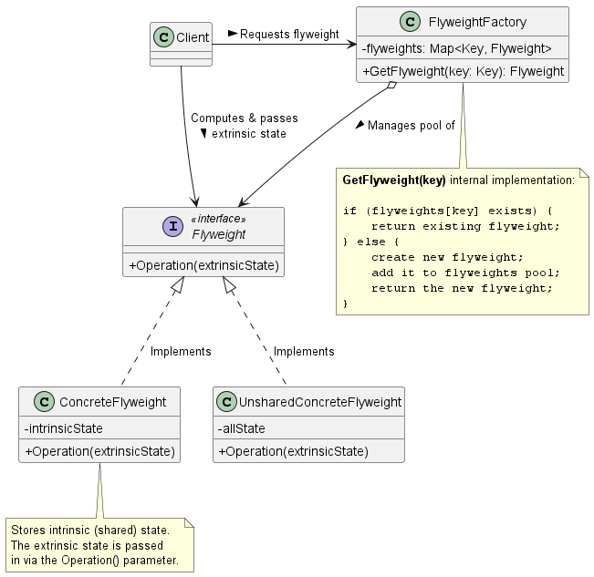
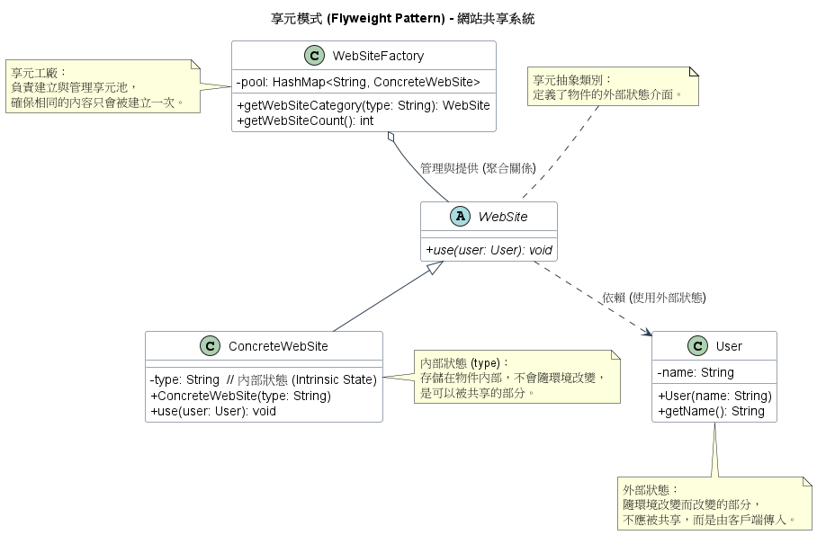

# 享元模式 (Flyweight Pattern)

在維護大型分散式系統、開發高效能遊戲引擎或是文字編輯器時，我們最怕遇到的問題之一就是 Out of Memory (OOM) 。

當系統中需要產生*數量極其龐大，但性質極為相似*的小型物件時。例如：一篇十萬字文章中的每一個字元物件，或是遊戲場景中的幾萬棵樹物件，如果我們單純使用 `new` 來為每一個實體分配記憶體，系統資源很快就會被消耗殆盡。

為了解決這個記憶體危機，**享元模式 (Flyweight Pattern)** 提供了非常精妙的底層記憶體優化架構。

1. 享元模式的核心概念

      **定義：** 運用共用技術來有效地支援大量細粒度（fine-grained）的物件。

      享元模式的核心思想非常簡單，**如果很多物件幾乎是一模一樣的，我們為什麼不讓它們共用同一個實體呢？** 為了達成這個目的，享元模式強制工程師將物件的狀態（State）嚴格拆分為兩種：

      1. **內部狀態 (Intrinsic State)：** 這是物件的本質，不隨外在環境改變，**可以被共用**。例如字元的字母碼 ('A', 'B') 或是一棵樹的 3D 網格模型。
      2. **外部狀態 (Extrinsic State)：** 這是物件會隨著環境變化的特徵，**不可以被共用**。例如字元在螢幕上的 X-Y 座標與顏色，或是樹在遊戲地圖上的位置與年齡。

      在享元模式中，我們只會在記憶體中保留一份*內部狀態*的實體（Flyweight）。當客戶端需要操作這個物件時，再將*外部狀態*當作參數傳遞給該物件的方法中執行。

2. 背後支撐的核心設計原則

      我們認為享元模式完美體現了以下設計原則與架構權衡：

      1. 找出會變動的部分，並將其分離 (Encapsulate what varies)
         我們將不變的*內部狀態*封裝在享元物件內部，並將會變動的*外部狀態*抽離出來，交由客戶端 (Client) 去計算與維護。這大幅減少了需要被實例化的物件數量。

      2. 空間與時間的權衡 (Space/Time Trade-off)
         這是在演算法設計中最經典的原則。享元模式本質上是**以運算時間換取記憶體空間**。共用物件大幅節省了記憶體 (Space)；但代價是，客戶端在呼叫物件時，必須即時尋找、計算並傳遞外部狀態，這會增加一些 CPU 的負擔 (Time)。

      3. 隱藏物件的建立細節 (Encapsulate Object Creation)
         客戶端不能自己使用 `new` 來建立享元物件，必須透過一個**享元工廠 (Flyweight Factory)** 來取得。工廠內部維護了一個物件池 (Pool)，確保相同的物件只會被建立一次，後續的請求都會回傳這個已存在的快取實例。

3. 享元模式類別圖 (Class Diagram)

      

      系統角色拆解與運作流程：
      * **`FlyweightFactory` (享元工廠)：** 負責建立並管理享元物件。它內部通常會有一個 Hash Map 當作快取池。當收到請求時，如果有現成的物件就回傳，沒有就建立一個新的。
      * **`Flyweight` (享元介面)：** 宣告了一個介面，讓具體的享元物件能透過參數 `extrinsicState` 接收並作用於外部狀態。
      * **`ConcreteFlyweight` (具體享元物件)：** 儲存*內部狀態 (intrinsicState)*的實作類別。它必須是可被共用的，不論在哪個環境下被呼叫，它的內部狀態都不會改變。
      * **`UnsharedConcreteFlyweight` (非共用具體物件)：** 享元介面*允許*共用，但不*強制*共用。有些複合的層級結構（例如文字排版中的列或欄）是不被共用的，但它們依然可以實作此介面。

4. 總結

      引入享元模式時，有幾個系統級別的坑需要小心：

      1. **物件的不可變性 (Immutability)：** `ConcreteFlyweight` 裡面的內部狀態一旦在建立時給定，就**絕對不允許被修改**。因為這個物件同時被成千上萬個 Client 共用，一旦改了會引發災難性的資料污染。
      2. **工廠的執行緒安全 (Thread-Safety)：** 在高併發的後端系統中，多個執行緒可能會同時向 `FlyweightFactory` 請求同一個 key 的物件。工廠內部的 `GetFlyweight` 方法與物件池 (Map) 必須做好上鎖 (Locking) 或併發控制 (Concurrent collection)，否則會產生 Race Condition。
      3. **記憶體洩漏風險 (Memory Leak)：** 由於 `FlyweightFactory` 會將物件快取在內部的 Map 裡，只要系統不重啟，這些物件的 Reference 就會一直存在，導致 Garbage Collector (GC) 無法回收它們。如果你的系統 key 值種類無限增長，必須實作 LRU (Least Recently Used) 淘汰機制或使用 Weak Reference 來避免 OOM。

5. 範例程式碼類別圖

      

      1. 內部狀態 (Intrinsic State)：在 `ConcreteWebSite` 中的 `type` 屬性（如 "新聞"、"部落格"）就是內部狀態。它在物件建立後就不會改變，因此可以被多個使用者安全地共享。
      2. 外部狀態 (Extrinsic State)：`User` 類別代表了外部狀態。每個網站的使用者可能不同，這部分資訊不存儲在享元物件中，而是在呼叫 use(User user) 方法時由外部傳入。
      3. 享元工廠 (Flyweight Factory)：`WebSiteFactory` 是此模式的核心。它維護一個 `pool`（通常是 HashMap），當請求某個類型的網站時，它會先檢查池中是否已有實例，若有則直接回傳，若無則建立新實例並加入池中。
      4. 效益：當系統需要大量相似物件時（例如幾千個網站實例），透過共享 `type` 相同的部分，可以極大地減少記憶體的開銷。
