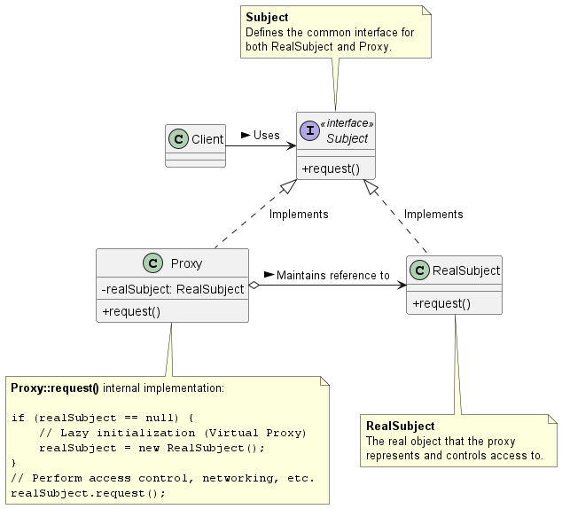

# 代理模式 (Proxy Pattern)

在分散式系統架構、微服務通訊（如 gRPC 或 RMI），或是處理極度消耗資源的物件（如資料庫連線池、大型檔案載入）時，我們經常需要一個「中間人」來幫我們打理底層的複雜細節、網路通訊或權限控管。

這時候，**代理模式 (Proxy Pattern)** 就是我們系統架構中的幫手。

1. 代理模式的核心概念

    **定義：** 代理模式為另一個物件提供一個代理人（Surrogate）或佔位符（Placeholder），以便控制對該物件的存取。

    你可以把代理模式想像成明星與經紀人的關係。客戶端（粉絲或廠商）不會直接聯絡明星本人（RealSubject），而是透過經紀人（Proxy）來溝通。經紀人會過濾請求、處理合約（網路通訊），只有在必要時才把工作交給明星本人來做。

    在系統工程實務上，代理模式有幾種非常經典的變體：
    1. **遠端代理 (Remote Proxy)：** 為位於不同位址空間（例如另一台伺服器）的物件提供區域代表。代理物件負責將方法呼叫打包並透過網路傳送給真正的遠端物件。
    2. **虛擬代理 (Virtual Proxy)：** 作為一個需要花費高昂代價才能建立的物件的替身。它會將物件的建立延遲到真正需要時才進行（也就是延遲載入 / Lazy Loading）。
    3. **保護代理 (Protection Proxy)：** 根據呼叫者的角色或權限，控制對原始物件特定方法的存取。
    4. **智慧參考代理 (Smart Reference Proxy)：** 當物件被存取時，執行額外的動作，例如計算該物件被參考的次數（Reference counting）或是實作寫入時複製（Copy-on-write）機制。

2. 代理模式背後的核心設計原則

    代理模式之所以能在不修改現有系統邏輯的前提下，無縫切入並增加強大功能，是因為它嚴格遵守了以下幾個物件導向設計原則：

    1. 針對介面寫程式，而不是針對實作寫程式 (Program to an interface, not an implementation)
        * 代理物件 (Proxy) 與真實物件 (RealSubject) 都必須實作相同的 `Subject` 介面。
        * **架構優勢：** 對客戶端 (Client) 而言，代理物件跟真實物件看起來是一模一樣的。客戶端只需針對 `Subject` 介面呼叫方法，完全不需要知道它正在跟一個代理人溝通，這達成了極高的*透明性*。

    2. 多用物件合成，少用繼承 (Favor composition over inheritance)
        * 代理物件內部會持有一個指向真實物件的參考 (Reference)。
        * **架構優勢：** 代理物件不透過繼承來獲得真實物件的行為，而是透過*合成 (Composition)」將請求「轉發 / 委派 (Delegate)*給真實物件處理。這使得代理物件能夠在轉發請求的前後，輕易地插入自己的邏輯（例如權限檢查或網路連線）。

    3. 單一職責原則 (Single Responsibility Principle) 與 關注點分離
        * 這點在系統架構上尤為重要。真實物件只需要專注於*核心業務邏輯*；而代理物件則專注於*非功能性需求 (Non-functional requirements)*，例如：網路傳輸細節、記憶體快取、存取權限控管等。這樣可以避免核心業務代碼被底層基礎設施邏輯污染。

3. 代理模式類別圖 (proxy)

    

4. 總結

    * Proxy vs. Decorator (裝飾者模式)： 這兩者的類別圖非常相似，但目的完全不同。裝飾者模式的目的是為物件*動態加上新的行為與責任*，而代理模式的目的是*控制對物件的存取*
    * Proxy vs. Adapter (轉接器模式)： 轉接器會改變物件的介面以符合客戶端的期望，而代理模式則是提供與真實物件完全相同的介面

    在實際的微服務架構開發中，你幾乎每天都在使用代理模式。當你透過 `gRPC` 或 `REST API` 呼叫另一個服務時，你所操作的 `Stub` 類別就是一個 **遠端代理 (Remote Proxy)**。當你使用 `Hibernate` 或 `JPA` 等 ORM 框架從資料庫讀取一筆資料，且該資料包含龐大的關聯表時，框架通常會回傳一個 **虛擬代理 (Virtual Proxy)**，直到你真正呼叫 getter 時才會發送 SQL 去資料庫把關聯資料撈回來。代理模式能讓我們的系統既保持物件導向的優雅，又能精準掌控底層資源。
